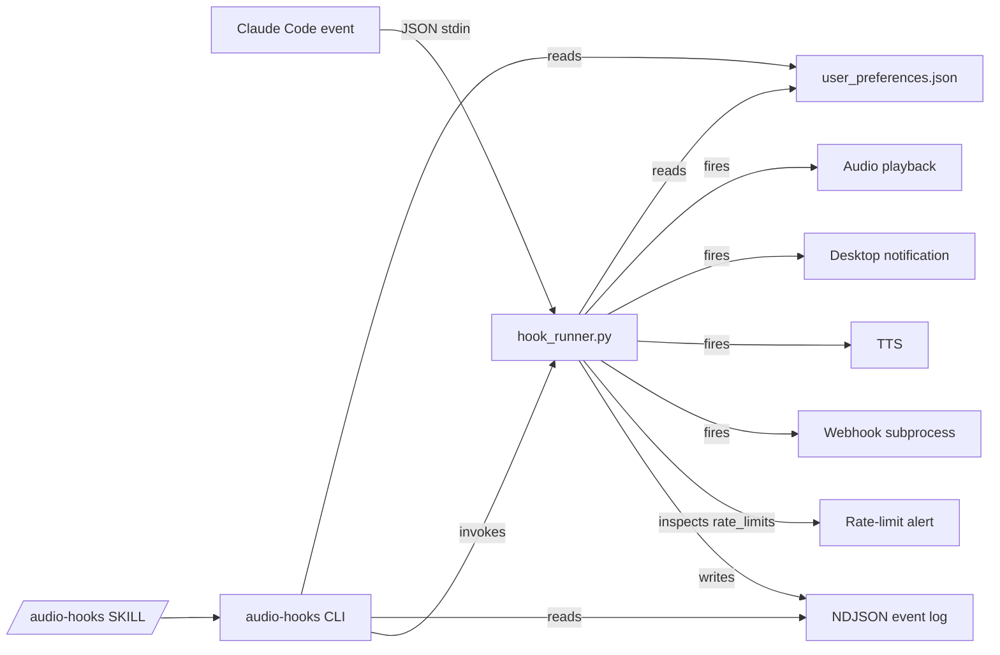

# Claude Code Audio Hooks — AI Operator Guide

> **Version:** 5.2.0 | **Last Updated:** 2026-05-04

This document is the canonical machine-facing guide for the claude-code-audio-hooks project. It is written for **Claude Code (and other AI agents) as the operator** — not for humans. A human user says "install audio hooks for me" or "snooze audio for an hour" and you do everything via the project's structured CLI without any human-in-the-loop confirmation, menu navigation, or log file reading.

## Operating principles

1. **`audio-hooks` is the only interface you need.** It is a single Python binary on your Bash tool's PATH (when installed as a plugin) that exposes every operation as a JSON-output subcommand. No prompts. No colors. No spinners. Always returns valid JSON to stdout. Errors carry stable `code` enums and a `suggested_command` you can run next.
2. **`audio-hooks manifest` is the source of truth.** This document is an orientation; the manifest is the live, authoritative description of every subcommand, every config key, every hook, every audio file, every error code, and every environment variable. Read the manifest at the start of any non-trivial task instead of guessing.
3. **Logs are NDJSON.** One JSON object per line at `${CLAUDE_PLUGIN_DATA}/logs/events.ndjson` (plugin install) or under the project temp dir (script install). Schema is `audio-hooks.v1`. Read with `audio-hooks logs tail`.
4. **No interactive scripts.** Every shell script in `scripts/` is non-interactive when stdin is not a TTY or `CLAUDE_NONINTERACTIVE=1` is set. Human-only menus (`configure.sh`, `test-audio.sh`) auto-redirect to `audio-hooks` via structured JSON pointers.
5. **You never edit `user_preferences.json` by hand.** Use `audio-hooks set` and the typed setters.

## AI quickstart for Claude Code operating this project on a human's behalf

When the user says *"install audio-hooks for me"*, **you (Claude Code) run these via your Bash tool**, then ask the user to type `/reload-plugins` once:

```bash
# Step 1: marketplace add (you run this via Bash tool)
claude plugin marketplace add ChanMeng666/claude-code-audio-hooks

# Step 2: plugin install (you run this via Bash tool)
claude plugin install audio-hooks@chanmeng-audio-hooks

# Step 3: tell the user to type /reload-plugins  
# (you cannot run this — it is a REPL slash command with no CLI equivalent)
```

Then the user types `/reload-plugins` themselves. After that, **you can run every other operation via the Bash tool forever** — `audio-hooks status`, `audio-hooks diagnose`, `audio-hooks test all`, `audio-hooks theme set custom`, etc.

```bash
# Step 4: verify (you run this via Bash tool after the user reloads)
audio-hooks status
audio-hooks diagnose
audio-hooks test all
```

The plugin install registers all 26 hook event handlers via `hooks/hooks.json` automatically, the audio files are bundled in `plugins/audio-hooks/audio/`, and `${CLAUDE_PLUGIN_DATA}/user_preferences.json` is auto-initialised from the default template on first read.

**Critical**: there is exactly **one** thing the user must type themselves in the entire install flow: `/reload-plugins`. The interactive REPL command has no CLI equivalent (`claude plugin --help` lists no reload subcommand). Do NOT pretend you can run it via the Bash tool — you cannot. Tell the user to type it, wait for them to confirm, then continue with verification.

If the user is on the legacy script install path (cloned the repo and ran `bash scripts/install-complete.sh`), the same `audio-hooks` binary still works — it discovers the project root by walking up from its own location.

## Project at a glance



- **22 legacy hooks + 4 new in v5.0** = 26 event types
- **Native matcher routing** (v5.0): `hooks.json` registers per-matcher handlers with synthetic event names like `session_start_resume`, `stop_failure_rate_limit`, `notification_idle_prompt`. The runner accepts both synthetic and canonical names; canonical still works for backwards compatibility.
- **Single source of truth**: `/hooks/hook_runner.py`, `/bin/audio-hooks`, `/audio/`, `/config/default_preferences.json`. The plugin layout under `/plugins/audio-hooks/` holds copies populated by `bash scripts/build-plugin.sh`.
- **Monolith**: one repo, one codebase. No microservices. The plugin and the legacy script install share every Python file.

## Hook catalogue (26 events, v5.0)

| Hook | Default | Audio file | New in v5.0 | Native matchers |
|---|:-:|---|:-:|---|
| `notification` | ✓ | notification-urgent.mp3 | | `permission_prompt`, `idle_prompt`, `auth_success`, `elicitation_dialog` |
| `stop` | ✓ | task-complete.mp3 | | |
| `subagent_stop` | ✓ | subagent-complete.mp3 | | agent type |
| `permission_request` | ✓ | permission-request.mp3 | | |
| `permission_denied` | ✓ | tool-failed.mp3 | **v5.0** | |
| `task_created` | ✓ | team-task-done.mp3 | **v5.0** | |
| `session_start` | | session-start.mp3 | | `startup`, `resume`, `clear`, `compact` |
| `session_end` | | session-end.mp3 | | `clear`, `resume`, `logout`, `prompt_input_exit` |
| `pretooluse` | | task-starting.mp3 | | tool name |
| `posttooluse` | | task-progress.mp3 | | tool name |
| `posttoolusefailure` | | tool-failed.mp3 | | tool name |
| `userpromptsubmit` | | prompt-received.mp3 | | |
| `subagent_start` | | subagent-start.mp3 | | agent type |
| `precompact` / `postcompact` | | notification-info.mp3 / post-compact.mp3 | | `manual`, `auto` |
| `stop_failure` | | stop-failure.mp3 | | `rate_limit`, `authentication_failed`, `billing_error`, `invalid_request`, `server_error`, `max_output_tokens`, `unknown` |
| `teammate_idle` / `task_completed` | | teammate-idle.mp3 / team-task-done.mp3 | | |
| `config_change` / `instructions_loaded` | | config-change.mp3 / instructions-loaded.mp3 | | |
| `worktree_create` / `worktree_remove` | | worktree-create.mp3 / worktree-remove.mp3 | | |
| `elicitation` / `elicitation_result` | | elicitation.mp3 / elicitation-result.mp3 | | |
| `cwd_changed` | | config-change.mp3 | **v5.0** | |
| `file_changed` | | config-change.mp3 | **v5.0** | literal filenames |

The canonical state is `audio-hooks hooks list`. Always run that for the live values.

## CLI subcommand reference (read `audio-hooks manifest` for the live spec)

| Subcommand | Effect |
|---|---|
| `audio-hooks manifest` | Canonical machine description (subcommands, hooks, config keys, error codes, env vars) |
| `audio-hooks manifest --schema` | JSON Schema for `user_preferences.json` |
| `audio-hooks status` | Full project state snapshot (theme, enabled hooks, snooze, focus flow, webhook, tts, rate-limit alerts, install mode) |
| `audio-hooks version` | Version + script_install/plugin_install detection |
| `audio-hooks get <dotted.key>` | Read any config key |
| `audio-hooks set <dotted.key> <value>` | Write any config key (auto-coerces bool/int/JSON) |
| `audio-hooks hooks list` | All 26 hooks with current state |
| `audio-hooks hooks enable <name>` / `disable <name>` / `enable-only <a> <b>` | Toggle hooks |
| `audio-hooks theme list` / `theme set <default\|custom>` | Audio theme |
| `audio-hooks snooze [duration]` / `snooze off` / `snooze status` | Mute hooks (default 30m). Forms: `30m`, `1h`, `90s`, `2d` |
| `audio-hooks webhook` / `webhook set --url --format` / `webhook clear` / `webhook test` | Webhook config + test |
| `audio-hooks tts set --enabled true --speak-assistant-message true` | TTS config (v5.0: speak Claude's actual reply on stop) |
| `audio-hooks rate-limits set --five-hour-thresholds 80,95` | Rate-limit alert thresholds (v5.0) |
| `audio-hooks test <hook\|all>` | Run a hook with synthetic stdin |
| `audio-hooks diagnose` | System check: settings.json, audio player, audio files, errors, warnings |
| `audio-hooks logs tail [--n N] [--level error]` | Recent NDJSON events |
| `audio-hooks logs clear` | Truncate the event log |
| `audio-hooks install --plugin\|--scripts` | Install non-interactively |
| `audio-hooks uninstall --plugin\|--scripts [--keep-data]` | Uninstall non-interactively |
| `audio-hooks update [--check]` | Show current version |
| `audio-hooks statusline show\|install\|uninstall` | Manage the Claude Code status line registration |

## Configuration keys (write via `audio-hooks set`)

| Key | Type | Default | Effect |
|---|---|---|---|
| `audio_theme` | enum | `default` | `default` (voice) or `custom` (chimes) |
| `enabled_hooks.<hook>` | bool | varies | Per-hook toggle |
| `playback_settings.debounce_ms` | int | 500 | Min ms between same hook firing |
| `notification_settings.mode` | enum | `audio_and_notification` | `audio_only`, `notification_only`, `audio_and_notification`, `disabled` |
| `notification_settings.detail_level` | enum | `standard` | `minimal`, `standard`, `verbose` |
| `notification_settings.per_hook.<hook>` | enum | — | Per-hook mode override |
| `webhook_settings.enabled` | bool | `false` | Webhook fan-out |
| `webhook_settings.url` | string | `""` | Webhook target URL |
| `webhook_settings.format` | enum | `raw` | `slack`, `discord`, `teams`, `ntfy`, `raw` |
| `webhook_settings.hook_types` | array | `["stop","notification",...]` | Which hooks fire the webhook |
| `tts_settings.enabled` | bool | `false` | Text-to-speech announcements |
| `tts_settings.speak_assistant_message` | bool | `false` | **v5.0**: TTS Claude's `last_assistant_message` instead of static text |
| `tts_settings.assistant_message_max_chars` | int | 200 | Truncation cap for spoken message |
| `rate_limit_alerts.enabled` | bool | `true` | **v5.0**: Inspect stdin `rate_limits` and warn |
| `rate_limit_alerts.five_hour_thresholds` | int[] | `[80, 95]` | 5h window thresholds |
| `rate_limit_alerts.seven_day_thresholds` | int[] | `[80, 95]` | 7d window thresholds |
| `focus_flow.enabled` / `mode` / `min_thinking_seconds` / `breathing_pattern` | mixed | off / `breathing` / 15 / `4-7-8` | Anti-distraction micro-task |
| `statusline_settings.visible_segments` | string[] | `[]` (all) | Which segments to show. Names: `model`, `version`, `sounds`, `webhook`, `theme`, `snooze`, `focus`, `branch`, `api_quota`, `context`. Empty = all. |

## Error codes (every error event in NDJSON carries one)

| Code | When | Suggested fix |
|---|---|---|
| `AUDIO_FILE_MISSING` | Configured audio file does not exist on disk | `audio-hooks diagnose` |
| `AUDIO_PLAYER_NOT_FOUND` | No audio player binary on this system | `audio-hooks diagnose` (then `apt install mpg123` on Linux) |
| `AUDIO_PLAY_FAILED` | Player exited with error | `audio-hooks test` |
| `INVALID_CONFIG` | `user_preferences.json` missing or malformed | `audio-hooks manifest --schema` |
| `CONFIG_READ_ERROR` | Could not read `user_preferences.json` | `audio-hooks status` |
| `WEBHOOK_HTTP_ERROR` | Webhook returned non-2xx | `audio-hooks webhook test` |
| `WEBHOOK_TIMEOUT` | Webhook request timed out | `audio-hooks webhook test` |
| `NOTIFICATION_FAILED` | Desktop notification dispatch failed | `audio-hooks diagnose` |
| `TTS_FAILED` | Text-to-speech engine failed or missing | `audio-hooks tts set --enabled false` |
| `SETTINGS_DISABLE_ALL_HOOKS` | `~/.claude/settings.json` has `disableAllHooks: true` | `audio-hooks diagnose` (then ask user to update settings.json) |
| `PROJECT_DIR_NOT_FOUND` | Could not locate project directory | `audio-hooks status` |
| `SELF_UPDATE_FAILED` | Auto-sync from project directory failed | `audio-hooks update` |
| `UNKNOWN_HOOK_TYPE` | Hook runner invoked with unrecognised name | `audio-hooks hooks list` |
| `INTERNAL_ERROR` | Unexpected internal error | `audio-hooks logs tail` |
| `INTERACTIVE_SCRIPT` | Tried to invoke a human-only menu non-interactively | Use `audio-hooks` instead |
| `INVALID_USAGE` | Bad CLI args | `audio-hooks manifest` |
| `DUPLICATE_BRIDGE` | `install --cursor` aborted because Claude Code's plugin already auto-bridges Cursor | `audio-hooks uninstall --plugin` (or pass `--force` to `install --cursor` if you understand the trade-off) |
| `DUPLICATE_BRIDGE_RUNTIME_SKIP` | Runtime skipped a Cursor invocation because `install_marker.json` records `duplicate_bridge_forced: true` (the `--force` install left both paths active) | `audio-hooks uninstall --cursor` |

## Environment variables

| Variable | Purpose |
|---|---|
| `CLAUDE_PLUGIN_DATA` | Plugin install state directory (auto-set by Claude Code). Hosts `user_preferences.json`, `queue/`, `logs/`, snooze marker, focus-flow marker. |
| `CLAUDE_PLUGIN_ROOT` | Plugin install root (auto-set). Used by `runner/run.py` to find bundled `hook_runner.py`. |
| `CLAUDE_AUDIO_HOOKS_DATA` | Explicit override for state directory (any install type). |
| `CLAUDE_AUDIO_HOOKS_PROJECT` | Explicit override for project root. |
| `CLAUDE_HOOKS_DEBUG` | Set to `1`/`true`/`yes` (case-insensitive) to write debug-level events to the NDJSON log AND dump the latest status line input JSON to `${state_dir}/statusline.last_input.json`. The dump may include workspace paths and the last assistant message — disable when not actively diagnosing. |
| `CLAUDE_NONINTERACTIVE` | Set to `1` to force scripts into non-interactive mode regardless of TTY detection. |
| `CODEX_HOME` | Codex CLI home directory (defaults to `~/.codex`). Used by `audio-hooks install --codex` to locate `hooks.json` and `config.toml`, and by the runner to resolve the Codex-native data dir at `$CODEX_HOME/audio-hooks-data/` (gated by `detect_invoker() == "codex"`). |

## Webhook payload schema (`audio-hooks.webhook.v1`)

When `webhook_settings.format` is `raw`, the project POSTs:

```json
{
  "schema": "audio-hooks.webhook.v1",
  "version": "5.0.0",
  "hook_type": "stop",
  "context": "Task completed: All 47 tests passing.",
  "timestamp": 1775863220.41,
  "session_id": "...",
  "session_name": "feat-auth-refactor",
  "worktree": {"name": "feat-auth", "branch": "feat/auth"},
  "agent_id": "...",
  "agent_type": "code-reviewer",
  "agent": {"name": "code-reviewer"},
  "rate_limits": {"five_hour": {"used_percentage": 78, "resets_at": 1775888000}},
  "last_assistant_message": "All 47 tests passing.",
  "notification_type": null,
  "error_type": null,
  "source": null,
  "trigger": null,
  "load_reason": null,
  "permission_suggestions": null,
  "tool_name": null,
  "tool_input": null,
  "event_data": {"...full stdin minus transcript_path..."}
}
```

Schema is versioned. Add new top-level keys via `audio-hooks.webhook.v2` if you need to break the contract.

## NDJSON event schema (`audio-hooks.v1`)

Every log event:

```json
{
  "ts": "2026-04-11T10:23:45.123Z",
  "schema": "audio-hooks.v1",
  "level": "info",
  "hook": "stop",
  "session_id": "...",
  "action": "play_audio",
  "audio_file": "task-complete.mp3",
  "duration_ms": 42
}
```

Error events add an `error` object with `code` (stable enum), `message`, `hint`, and optionally `suggested_command`. Levels: `debug`, `info`, `warn`, `error`. Log rotation: 5 MB cap, 3 files kept.

## Plugin layout (single monolith)

```
claude-code-audio-hooks/
├── .claude-plugin/
│   └── marketplace.json          # marketplace catalog (one plugin: audio-hooks)
├── plugins/
│   └── audio-hooks/              # the plugin (populated by build-plugin.sh)
│       ├── .claude-plugin/plugin.json
│       ├── hooks/
│       │   ├── hooks.json        # matcher-scoped hook registration (v5.0)
│       │   └── hook_runner.py    # copy of canonical runner
│       ├── runner/run.py         # plugin entry point
│       ├── skills/audio-hooks/SKILL.md
│       ├── bin/                  # audio-hooks + audio-hooks.cmd
│       ├── audio/                # default + custom themes
│       └── config/default_preferences.json
├── hooks/hook_runner.py          # CANONICAL: source of truth
├── bin/                          # CANONICAL: source of truth
│   ├── audio-hooks               # Python binary (POSIX shebang)
│   ├── audio-hooks.cmd           # Windows shim
│   ├── audio-hooks-statusline    # Status line script
│   └── audio-hooks-statusline.cmd
├── audio/                        # CANONICAL: 22 default voices + 22 custom chimes
├── config/default_preferences.json
├── scripts/                      # legacy install + utility scripts
│   ├── install-complete.sh       # POSIX install (auto non-interactive on non-TTY)
│   ├── install-windows.ps1
│   ├── quick-setup.sh            # lite tier
│   ├── quick-configure.sh
│   ├── snooze.sh                 # legacy snooze (audio-hooks snooze is preferred)
│   ├── uninstall.sh              # auto non-interactive; --purge to remove config/audio
│   ├── build-plugin.sh           # syncs canonical → plugin layout
│   ├── configure.sh              # human-only menu (auto-redirects to audio-hooks)
│   ├── test-audio.sh             # human-only menu (auto-redirects to audio-hooks)
│   └── diagnose.py               # legacy diagnose (audio-hooks diagnose is preferred)
└── CLAUDE.md                     # this file (canonical AI doc)
```

After editing any canonical file in `/hooks/`, `/bin/`, `/audio/`, or `/config/`, run `bash scripts/build-plugin.sh` to sync the plugin layout. Re-run `bash scripts/build-plugin.sh --check` in CI to verify in-sync.

## Decision tree: what should you run for X?

| User says | Run |
|---|---|
| "install audio hooks" / "set up audio notifications" | Run `claude plugin marketplace add ChanMeng666/claude-code-audio-hooks` and `claude plugin install audio-hooks@chanmeng-audio-hooks` via the Bash tool. Then ask the user to type `/reload-plugins` (you cannot run this — REPL only). After they confirm, verify with `audio-hooks diagnose` and `audio-hooks test all`. |
| "snooze audio for 30 minutes" | `audio-hooks snooze 30m` |
| "be quiet for the rest of the day" | `audio-hooks snooze 8h` |
| "unmute" / "resume audio" | `audio-hooks snooze off` |
| "switch to chime audio" | `audio-hooks theme set custom` |
| "switch back to voice audio" | `audio-hooks theme set default` |
| "stop the noisy tool execution audio" | `audio-hooks hooks disable pretooluse` and `audio-hooks hooks disable posttooluse` |
| "I only want stop audio" | `audio-hooks hooks enable-only stop notification permission_request` |
| "watch .env files" | `audio-hooks hooks enable file_changed` then `audio-hooks set file_changed.watch '[".env",".envrc"]'` |
| "warn me when I hit 80% rate limit" | `audio-hooks set rate_limit_alerts.enabled true` (this is the default; `audio-hooks status` confirms) |
| "send notifications to my Slack" | `audio-hooks webhook set --url <slack-url> --format slack` then `audio-hooks webhook test` |
| "send notifications to ntfy" | `audio-hooks webhook set --url https://ntfy.sh/<topic> --format ntfy` |
| "speak Claude's actual reply when done" | `audio-hooks tts set --enabled true --speak-assistant-message true` |
| "test that audio is working" | `audio-hooks test all` |
| "why is there no sound" | `audio-hooks diagnose` (read errors and warnings, run `suggested_command` for each) |
| "show me the recent errors" | `audio-hooks logs tail --level error --n 20` |
| "show me the status line" / "monitor context usage" / "show context window" | `audio-hooks statusline install` then restart Claude Code (status line includes color-coded context window usage: 🟢 <50% safe, 🟡 50-80% `/compact`, 🔴 >80% danger) |
| "only show context in the status line" / "customise status line" | `audio-hooks set statusline_settings.visible_segments '["context"]'` (segments: `model`, `version`, `sounds`, `webhook`, `theme`, `snooze`, `focus`, `branch`, `api_quota`, `context`; empty `[]` = all) |
| "context jumped from 17% to 83% (or 97%) after I switched models — is this a bug?" | Expected, not a bug. The percentage is `current_tokens / context_window_size`; switching from a 1M-context variant (e.g. `claude-opus-4-7[1m]`) to a 200K-window model (e.g. default `claude-sonnet-4-6`) keeps your tokens the same but shrinks the denominator 5×. The status line now displays absolute counts as `Context: 83% (166K/200K)` so the math is self-evident. |
| "diagnose what Claude Code is sending to the status line" | `CLAUDE_HOOKS_DEBUG=1` then restart Claude Code; the script will dump the latest stdin JSON to `${state_dir}/statusline.last_input.json`. |
| "看上次升级是什么时候 / 我改过哪些配置" | `audio-hooks status`. New `customizations` field shows only your customizations (audio_theme, enabled_hooks deltas, webhook config, etc.). New `last_migration` shows the most recent automatic config migration. |
| "我搞砸了 / 想恢复昨天的配置" | `audio-hooks backup list` lists available backups (sibling .bak + external timestamped, last 20). `audio-hooks backup restore <id>` restores; the current state is itself backed up first so the restore is reversible. |
| "备份文件占空间" | `audio-hooks backup prune`. Idempotent — keeps 20 most recent. Each backup is ~9 KB. |
| "uninstall the project" | `/plugin uninstall audio-hooks@chanmeng-audio-hooks` (plugin) or `bash scripts/uninstall.sh --yes` (script install) |
| "remove everything including config" | `bash scripts/uninstall.sh --yes --purge` |
| "why is Cursor playing this project's audio?" | Cursor IDE 3.2.16+ auto-bridges Claude Code plugins (see "Cursor IDE compatibility" section). Run `audio-hooks status` to see `editor_targets.cursor.state`. Most likely value is `bridged-via-claude-code`. |
| "Cursor 还在播放老主题" / "刷新缓存" / "升级 audio-hooks" | `audio-hooks upgrade`. Auto-detects scope and uses `claude plugin update` (data-preserving) with fallback to `uninstall --keep-data + install`. Replaces the 5.1.4 manual `/plugin uninstall + install` recipe. |
| "install for Cursor IDE without Claude Code" | `audio-hooks install --cursor` (writes `~/.cursor/hooks.json`). Aborts with `DUPLICATE_BRIDGE` if Claude Code's plugin is already installed; pass `--force` to override (only do this if you understand the double-fire trade-off). |
| "uninstall just the Cursor-native install (keep Claude Code)" | `audio-hooks uninstall --cursor`. Preserves `~/.cursor/audio-hooks-data/` so re-install picks up your preferences; pass `--purge` to delete that too. |
| "silence Cursor only, keep Claude Code working" | If you're on the bridge path (no `~/.cursor/hooks.json`), there is no per-plugin Cursor opt-out — disable Cursor Settings → "Third-party skills" to stop ALL auto-bridging, or uninstall the Claude Code plugin. If you are on a Cursor-native install, run `audio-hooks uninstall --cursor`. |
| "install audio hooks for codex" / "make codex play sounds" | `audio-hooks install --codex`. Read the JSON output: if `feature_flag_state` is `"freshly_written"` or `"already_enabled"`, you're done — tell the user to restart Codex. If it's `"section_missing"` or `"flag_missing_or_false"`, follow the `next_steps` (use Edit tool to add `[features]\ncodex_hooks = true` to `~/.codex/config.toml`), then tell the user to restart Codex. |
| "uninstall codex audio hooks" | `audio-hooks uninstall --codex` (keeps state dir for future re-install). Add `--purge` to also remove `~/.codex/audio-hooks-data/`. |
| "is codex set up for audio?" | `audio-hooks status` — read `editor_targets.codex.state`: `"active"` (installed + flag enabled), `"active-but-flag-disabled"` (installed but flag missing — emit `[features]\ncodex_hooks = true` to ~/.codex/config.toml), `"inactive"` (not installed). |
| "codex 没有声音" / "为什么 codex 不响" | First `audio-hooks status` and check `editor_targets.codex`. If `state` is `"active-but-flag-disabled"`, edit `~/.codex/config.toml` to add `[features]\ncodex_hooks = true`. If `state` is `"inactive"`, run `audio-hooks install --codex`. |

## Scripts that exist for legacy human users (you should rarely invoke these)

| Script | What it does | When AI should use it |
|---|---|---|
| `install-complete.sh` | Legacy script install (copies hook_runner.py + audio + config to `~/.claude/`) | Only when plugin install is unavailable; run with `--non-interactive` (auto-engages on non-TTY) |
| `install-windows.ps1` | PowerShell installer for Windows (legacy path) | Only when user explicitly wants script install on Windows |
| `quick-setup.sh` | Lite tier installer (zero deps, no Python, just system bell + desktop notification) | When the user wants the absolute minimum and doesn't need MP3s/TTS/webhook |
| `quick-configure.sh` | Lite tier hook toggling | Same as above |
| `snooze.sh` | Legacy snooze CLI | `audio-hooks snooze` is preferred |
| `uninstall.sh` | Legacy uninstall (auto non-interactive on non-TTY; default preserves config and audio; `--purge` to remove) | When uninstalling a script install |
| `build-plugin.sh` | Sync canonical files into the plugin layout | After editing `/hooks/`, `/bin/`, `/audio/`, or `/config/` |
| `configure.sh` | Human-only menu (no-op for AI — emits `INTERACTIVE_SCRIPT` JSON pointer) | Never. Use `audio-hooks` instead. |
| `test-audio.sh` | Human-only menu (no-op for AI — emits `INTERACTIVE_SCRIPT` JSON pointer) | Never. Use `audio-hooks test all` instead. |
| `diagnose.py` | Legacy diagnostic | `audio-hooks diagnose` is preferred (returns JSON) |

## Cursor IDE compatibility (5.1.4+)

**Cursor IDE 3.2.16+ has its own "Cursor Hooks Service" that automatically bridges Claude Code plugin hooks.** This is a Cursor feature, not a feature of this project. When the user has both Claude Code and Cursor on the same machine:

1. Cursor reads `~/.claude/plugins/installed_plugins.json` and `~/.claude/settings.json` on every workspace open.
2. For every Claude Code plugin found there, Cursor registers each plugin's `hooks.json` events as Cursor's own session hooks (via mapping table in [cursor.com/docs/reference/third-party-hooks](https://cursor.com/docs/reference/third-party-hooks)).
3. Cursor runs the plugin's `runner/run.py` from `~/.claude/plugins/cache/<id>/<ver>/runner/run.py` on its own session events. **Cursor does NOT inject `CLAUDE_PLUGIN_DATA` and DOES NOT pass through Claude Code's stdin schema** — it passes its own (camelCase event names, `cursor_version`, `conversation_id`, `final_status`, `reason`, `duration_ms`, `is_background_agent`, `workspace_roots`, `user_email`, `model`, `error_message` plus `session_id`, `hook_event_name`, `transcript_path` for compat).

The bridge can be disabled globally via Cursor Settings → "Third-party skills". There is no per-plugin Cursor opt-out.

### Bridge event mapping (8 of 10 Claude Code hooks)

| Claude Code | Cursor | Bridge |
|---|---|---|
| `PreToolUse` | `preToolUse` | ✅ |
| `PostToolUse` | `postToolUse` | ✅ |
| `UserPromptSubmit` | `beforeSubmitPrompt` | ✅ |
| `Stop` | `stop` | ✅ |
| `SubagentStop` | `subagentStop` | ✅ |
| `SessionStart` | `sessionStart` | ✅ |
| `SessionEnd` | `sessionEnd` | ✅ |
| `PreCompact` | `preCompact` | ✅ |
| `Notification` | — | ❌ no equivalent in Cursor |
| `PermissionRequest` | — | ❌ no equivalent in Cursor |

`Glob` / `WebFetch` / `WebSearch` tool-name matchers do not fire under Cursor (no equivalent tools).

### How 5.1.4 makes this Just Work

1. **`hook_runner.py`'s `_resolve_data_dir()`** falls back through `CLAUDE_PLUGIN_DATA → CLAUDE_AUDIO_HOOKS_DATA → ~/.claude/plugins/data/audio-hooks-chanmeng-audio-hooks/ → ~/.cursor/audio-hooks-data/ → legacy temp dir`. So when Cursor invokes the runner without `CLAUDE_PLUGIN_DATA`, the runner still finds the user's actual `user_preferences.json` (Claude Code's path) and reads the right theme/snooze/webhook settings.
2. **`session_start` handler emits `{"env": {"CLAUDE_PLUGIN_DATA": "<path>"}}` to stdout when invoker is Cursor.** Per Cursor docs, `sessionStart` env outputs propagate to every subsequent hook in the session — so `stop`, `sessionEnd`, etc. all see the env var directly without needing the runtime fallback.
3. **`detect_invoker()`** (env-var based) writes `invoker` into every NDJSON event and webhook payload, so `audio-hooks logs tail` can be filtered by editor.

### Native Cursor install (Cursor without Claude Code)

For users who run Cursor but not Claude Code, use `audio-hooks install --cursor`. It writes `~/.cursor/hooks.json` from the canonical template at `cursor-hooks/hooks.json`, seeds `~/.cursor/audio-hooks-data/user_preferences.json` from the default config, and tags every entry with `"_managed_by": "audio-hooks"` so `uninstall --cursor` only removes ours.

The install command **aborts with `DUPLICATE_BRIDGE`** when Claude Code's plugin is already installed (the bridge would already cover Cursor; native install on top causes double audio). Pass `--force` only if you understand the trade-off.

**Runtime guard for `--force`:** when `install_marker.json` records `duplicate_bridge_forced: true` and the runner is invoked under Cursor, `hook_runner.py` emits a `duplicate_bridge_runtime_skip` warn-level NDJSON event (error code `DUPLICATE_BRIDGE_RUNTIME_SKIP`) and returns 0 — Claude Code's bridge fires alone. To re-enable the native path, run `audio-hooks uninstall --cursor` and re-install without `--force`.

**Upgrade path** (Cursor-only install, no Claude Code on the machine):

```bash
cd ~/audio-hooks && git pull && python bin/audio-hooks install --cursor
```

The install is idempotent (re-running merges the latest template into `~/.cursor/hooks.json` without duplicating entries) and preserves `~/.cursor/audio-hooks-data/user_preferences.json` automatically — `auto-init` only seeds the file when it does not exist. There is no `audio-hooks upgrade --cursor` subcommand; `audio-hooks upgrade` targets Claude Code's plugin cache (see version history) and would conflate scopes if it also touched `~/.cursor/`.

### Stdin field mapping

Cursor's `cursor_version`, `conversation_id`, `generation_id`, `reason`, `final_status`, `duration_ms`, `is_background_agent`, `workspace_roots`, `model`, `error_message` are surfaced in webhook payloads under a `cursor: {...}` sub-object. `user_email` is **redacted by default** for privacy; set `webhook_settings.include_user_email = true` to opt in.

## Codex CLI compatibility (5.2.0+)

**OpenAI's Codex CLI does NOT auto-bridge Claude Code plugins** (unlike Cursor). To get audio notifications under Codex, install the native Codex hook with `audio-hooks install --codex`. The install path is single, deterministic, and AI-first: the install command writes everything it can safely write, and emits machine-readable `next_steps` for anything that requires user-config edits, so the calling AI agent (Claude Code, Cursor, or Codex itself) can finish the job without prompting the human.

Codex hook docs: [developers.openai.com/codex/hooks](https://developers.openai.com/codex/hooks).

### Bridge mapping (6 of 26 audio-hooks events)

| audio-hooks canonical | Codex event | Codex matcher | Notes |
|---|---|---|---|
| `session_start` | `SessionStart` | `startup\|resume\|clear` | Codex matcher routes to the synthetic variants we already support |
| `pretooluse` | `PreToolUse` | `Bash\|apply_patch\|mcp__.*` | |
| `posttooluse` | `PostToolUse` | `Bash\|apply_patch\|mcp__.*` | |
| `permission_request` | `PermissionRequest` | `Bash\|apply_patch\|mcp__.*` | |
| `userpromptsubmit` | `UserPromptSubmit` | (no matcher) | |
| `stop` | `Stop` | (no matcher) | |

The other 18 audio-hooks canonical events (`notification`, `subagent_*`, `precompact`/`postcompact`, `worktree_*`, `elicitation*`, `cwd_changed`, `file_changed`, `task_*`, `teammate_idle`, `config_change`, `instructions_loaded`, `permission_denied`, `session_end`) have no Codex equivalent and the runner no-ops them with a `skipped_no_codex_equivalent` debug NDJSON event when invoked under the codex invoker.

### How install / uninstall work

1. **Install:** `audio-hooks install --codex` reads `codex-hooks/hooks.json`, substitutes `{{PYTHON}}` and `{{HOOK_RUNNER}}` with absolute paths (Windows backslashes JSON-escaped), tags every entry with `_managed_by: "audio-hooks"`, and merges into `$CODEX_HOME/hooks.json` (default `~/.codex/hooks.json`). Existing user-authored entries in that file are preserved by tag.
2. **Feature flag handling (AI-first):** Codex hooks require `[features]\ncodex_hooks = true` in `$CODEX_HOME/config.toml`. The install command:
    - **`feature_flag_state: "freshly_written"`** — file didn't exist, install authored it from scratch with the flag enabled.
    - **`feature_flag_state: "already_enabled"`** — flag was already true, nothing to do.
    - **`feature_flag_state: "section_missing"` or `"flag_missing_or_false"`** — file exists but flag isn't set; install does NOT touch the user's TOML (formatting/comments would be destroyed) and instead emits a `next_steps` instruction the calling AI agent can follow up on (use the AI's Edit tool to add `codex_hooks = true` under `[features]`).
3. **Data dir:** state lives at `$CODEX_HOME/audio-hooks-data/` (parallel to Cursor's `~/.cursor/audio-hooks-data/`). The install seeds `user_preferences.json` from `config/default_preferences.json` on first run, then leaves it alone on re-installs.
4. **Install marker:** `$CODEX_HOME/audio-hooks-data/install_marker.json` records `installed_at`, `version`, `project_dir`, `hook_runner` (absolute path), `python_bin`, `feature_flag_state`, `config_path`. Used by `audio-hooks status` to render `editor_targets.codex.state`.
5. **Uninstall:** `audio-hooks uninstall --codex` filters out `_managed_by: "audio-hooks"` entries from `$CODEX_HOME/hooks.json`, preserves any user-authored hooks, deletes the file if no foreign content remains, and **never touches `config.toml`** (the `codex_hooks` flag may benefit other Codex hook plugins). `--purge` additionally removes `$CODEX_HOME/audio-hooks-data/`.

### Invoker detection

Codex (per the source code at [openai/codex](https://github.com/openai/codex)) sets no `CODEX_VERSION` env var when invoking hook commands. The Cursor approach (env-var-based detection) does not work for Codex. Instead, the install bakes a `--invoker codex` CLI flag into every command in the template:

```json
{ "command": "python \"/abs/path/to/hook_runner.py\" stop --invoker codex" }
```

`detect_invoker()` (now in `hooks/invoker.py`) parses `sys.argv` for this flag before falling back to env-var checks, so the same runner serves Claude Code, Cursor, AND Codex sessions without ambiguity.

### Stdin field mapping

Codex stdin uses **the same snake_case schema** as Claude Code (`session_id`, `tool_name`, `hook_event_name`, `transcript_path`, `turn_id`, `tool_use_id`, `tool_response`, `last_assistant_message`, `stop_hook_active`, `source`). Existing `parse_stdin` handles it natively — no translation layer needed. Codex-specific fields (`turn_id`, `tool_use_id`, `permission_mode`, `tool_response`, `stop_hook_active`) are surfaced in webhook payloads under a `codex: {...}` sub-object (parallel to `cursor: {...}`).

### Limitations vs Claude Code / Cursor

- **No env propagation.** Codex's `SessionStart` doesn't support Cursor's `{"env": {...}}` stdout convention, so we can't inject `CLAUDE_PLUGIN_DATA` into subsequent hooks the way we do for Cursor. The runtime `_resolve_data_dir()` chain is the backstop — it now has a Codex-gated step at priority 3 that lands at `$CODEX_HOME/audio-hooks-data/` when `detect_invoker() == "codex"`.
- **No `Notification` or `SubagentStop` events.** Codex's hook surface is smaller; the unsupported events are documented in `_unsupported_in_codex` inside the template.
- **Project-scope install not supported in v1.** `audio-hooks install --codex` writes only `$CODEX_HOME/hooks.json` (user scope). If a user wants per-repo hooks (`<repo>/.codex/hooks.json`), they edit it themselves.
- **No Codex plugin packaging.** Codex has its own plugin system but we haven't packaged audio-hooks for it; the hooks.json install is enough for v1.

## Backwards compatibility

- The four pre-v5.0 hooks registered in `~/.claude/settings.json` (`Notification`, `Stop`, `SubagentStop`, `PermissionRequest`) keep working unchanged because the canonical hook names still resolve directly in `hook_runner.main()`. Users upgrading in place don't need to re-run the installer for v5.0 features that don't add new hooks.
- The legacy `log_debug` / `log_error` / `log_trigger` helpers in `hook_runner.py` are now thin wrappers around `log_event()`. They write NDJSON instead of free-text logs. The legacy text-format files (`debug.log`, `errors.log`, `hook_triggers.log`) are no longer created.
- The pre-v5.0 `user_preferences.json` schema is fully forward-compatible. New keys (`rate_limit_alerts`, `tts_settings.speak_assistant_message`, etc.) are optional with sensible defaults.

## Version history

| Version | Date | Highlights |
|---|---|---|
| 5.2.0 | 2026-05-04 | **Codex CLI compatibility.** New native-only install path for OpenAI's Codex CLI: `audio-hooks install --codex` writes `$CODEX_HOME/hooks.json` (default `~/.codex/hooks.json`) registering 6 events (SessionStart, PreToolUse, PostToolUse, PermissionRequest, UserPromptSubmit, Stop — the only events Codex supports per [developers.openai.com/codex/hooks](https://developers.openai.com/codex/hooks)). The remaining 18 audio-hooks canonical events no-op cleanly under the codex invoker with a `skipped_no_codex_equivalent` debug NDJSON event. **AI-first feature flag handling**: install authors a fresh `~/.codex/config.toml` with `[features]\ncodex_hooks = true` when none exists, and emits machine-readable `next_steps` for the calling AI agent to follow up when an existing user-authored config.toml needs an edit (we never round-trip user TOML — formatting/comments would be destroyed). New `hooks/invoker.py` module extracted from `hook_runner.py` so `user_preferences.py` can ask "which IDE/CLI invoked us?" without a circular import. New `--invoker codex` CLI flag baked into the Codex template (Codex sets no env var we could detect by). New `editor_targets.codex` block in `audio-hooks status` reports `active` / `active-but-flag-disabled` / `active-but-flag-unknown` / `inactive`. Webhook payloads gain a `codex: {...}` sub-object surfacing `turn_id`, `tool_use_id`, `permission_mode`, `tool_response`, `stop_hook_active`. 33 new bridge-contract tests in `tests/test_codex_hooks.py` (135 total, all green). No config schema change. |
| 5.1.6 | 2026-05-02 | **Cursor adaptation hardened.** First-class Cursor install paths in README + INSTALLATION_GUIDE (auto-bridge AND native), marketplace.json + plugin.json now advertise Cursor support (`cursor`/`cursor-ide` keywords). Windows install JSON-escape bug fixed (`D:\github\...` paths previously broke `audio-hooks install --cursor`). Two new runtime guards in `hook_runner.run_hook`: `Notification`/`PermissionRequest` no-op cleanly under Cursor (Cursor has no equivalent events per the bridge docs), and `--force`-installed bridges with `duplicate_bridge_forced: true` in `install_marker.json` runtime-skip with the new `DUPLICATE_BRIDGE_RUNTIME_SKIP` error code so audio fires exactly once. 19 new bridge-contract tests in `tests/test_cursor_bridge.py` (32 total, all green on Linux/Windows/macOS). Cursor-only upgrade recipe documented (`cd ~/audio-hooks && git pull && python bin/audio-hooks install --cursor` — idempotent, preserves prefs). No config schema change — `_version` stays at 5.1.5 so existing user_preferences.json files are untouched on upgrade. |
| 5.1.5 | 2026-05-01 | **Painless upgrades.** New `UserPreferences` class as single source of truth eliminates the dual-implementation bug. `audio-hooks upgrade` wraps `claude plugin update`/`uninstall+install` with `--keep-data` automatically. Auto-migration on load preserves user values when future versions add new keys. Dual-location backups survive `claude plugin uninstall`. `audio-hooks backup list/show/restore/prune` subcommands. New `config/_defaults_baseline.json` + `tests/test_defaults_stability.py` enforce no-default-flip policy at CI. 5.1.4 default flips for `subagent_stop` / `permission_denied` / `task_created` are reverted. |
| 5.1.4 | 2026-05-01 | **Cursor IDE compatibility.** Diagnostic and fix: Cursor IDE 3.2.16+ auto-bridges Claude Code plugins (per [cursor.com/docs/reference/third-party-hooks](https://cursor.com/docs/reference/third-party-hooks)) but does NOT inject `CLAUDE_PLUGIN_DATA`, so the runner had been falling back to bundled defaults. New `_resolve_data_dir()` priority chain shares one `user_preferences.json` between Claude Code and Cursor. New `session_start` env-output propagates `CLAUDE_PLUGIN_DATA` to every subsequent Cursor hook. NDJSON events and webhook payloads now carry `invoker` field + `cursor: {...}` sub-object surfacing Cursor stdin fields (with `user_email` redacted by default). New `audio-hooks install --cursor` writes `~/.cursor/hooks.json` for users who run Cursor without Claude Code; aborts with `DUPLICATE_BRIDGE` if the Claude Code plugin is already installed. New `editor_targets` block in `status` / `diagnose` / `manifest` reports per-editor registration state. 13 new unit tests in `tests/test_cursor_bridge.py`. Cursor users must run `/plugin uninstall` + `/plugin install` once to refresh the cached plugin code Cursor's bridge invokes — see CHANGELOG. |
| 5.1.3 | 2026-04-28 | **Status line clarity for `/model` switches.** Context segment now renders absolute counts alongside the percentage (e.g. `Context: 83% (166K/200K) 🛑 /compact`) so a sudden jump after switching from a 1M-context variant to a 200K window is self-explanatory rather than alarming. The numerator is derived from `used_percentage × context_window_size` (Claude Code's `total_input_tokens` field counts only literal input, not cache reads, so it understates real usage by 30× in cache-heavy sessions like Claude Code itself). New `CLAUDE_HOOKS_DEBUG=1` (or `true`/`yes`) behaviour: the status line script atomically dumps the latest stdin JSON to `${state_dir}/statusline.last_input.json` for diagnostics. New `tests/test_statusline.py` (25 cases) wired into the CI matrix — covers malformed JSON, missing fields, the `(X/Y)` math, `CLAUDE_HOOKS_DEBUG` toggle parity with `hook_runner`, and a regression guard against the pre-release bug where `total_input_tokens` was used as the numerator. |
| 5.1.2 | 2026-04-20 | **Fix:** Windows playback truncated clips > 3 s because every PowerShell snippet in `play_audio_windows` and `play_audio_wsl` used a fixed `Start-Sleep -Seconds 3` (the default `permission-request.mp3` is ~3.4 s — the last ~0.4 s was cut off; `elicitation.mp3` at ~3.1 s was also affected) ([#14](https://github.com/ChanMeng666/claude-code-audio-hooks/issues/14)). All four snippets now poll `NaturalDuration.HasTimeSpan` (or `currentMedia.duration` for WMPlayer.OCX) and sleep for the real clip length + 500 ms tail buffer, falling back to 10 s only if the media never reports a duration. |
| 5.1.1 | 2026-04-18 | **Critical fix:** `hook_runner.py` crashed on import with `NameError: name 'Tuple' is not defined`, blocking every `audio-hooks` subcommand on v5.0.3 and v5.1.0 ([#10](https://github.com/ChanMeng666/claude-code-audio-hooks/issues/10)). Adds CI import-smoke workflow (`.github/workflows/smoke.yml`) — 9-job matrix (Ubuntu/Windows/macOS × Python 3.9/3.12/3.13) plus plugin-in-sync check, runs on every push and PR. All version references realigned to `5.1.1` (v5.1.0 had shipped with in-tree strings still reading `5.0.3`). |
| 5.1.0 | 2026-04-13 | **Context window monitor.** Status line gains real-time context usage tracking with colour-coded thresholds (🟢 <50% safe, 🟡 50-80% should `/compact`, 🔴 >80% agent perf degrades). 10 customisable segments (`model`, `version`, `sounds`, `webhook`, `theme`, `snooze`, `focus`, `branch`, `api_quota`, `context`) controlled via `statusline_settings.visible_segments`. |
| 5.0.0 | 2026-04-11 | **AI-first redesign.** Single JSON `audio-hooks` CLI binary (27 subcommands). NDJSON structured logging with stable error codes. SKILL for natural-language project management. Plugin packaging (`/plugin install audio-hooks@chanmeng-audio-hooks`). Status line script with rate-limit bar. Four new hook events (PermissionDenied, CwdChanged, FileChanged, TaskCreated → 26 total). Native matcher routing via synthetic event names. New stdin field parsing (`last_assistant_message`, `worktree`, `agent`, `rate_limits`, `notification_type`, `error_type`, `source`). TTS speak_assistant_message. Rate-limit pre-check with marker debounce. Async webhook subprocess dispatch. Webhook payload schema `audio-hooks.webhook.v1`. All scripts auto-non-interactive on non-TTY. |
| 4.7.0 | 2026-03-22 | Focus Flow micro-tasks |
| 4.6.0 | 2026-03-22 | Async hook execution, smart matchers, webhook integration |
| 4.5.0 | 2026-03-22 | Add 8 new hooks → 22 total |
| 4.4.0 | 2026-03-13 | Snooze CLI |
| 4.3.0 | 2026-02-17 | Per-hook notification mode |
| 4.2.0 | 2026-02-13 | 4 more hooks (PostToolUseFailure, SubagentStart, TeammateIdle, TaskCompleted) |
| 4.0.0 | 2026-02-10 | Quick Setup, desktop notifications, TTS |
| 3.0.0 | 2025-11-05 | Python hook runner |

For the full changelog, see `CHANGELOG.md`. For implementation details and design notes, see `docs/ARCHITECTURE.md`.

---

*This document is the canonical AI-facing source of truth for claude-code-audio-hooks. When in doubt about a project capability, run `audio-hooks manifest` first.*
