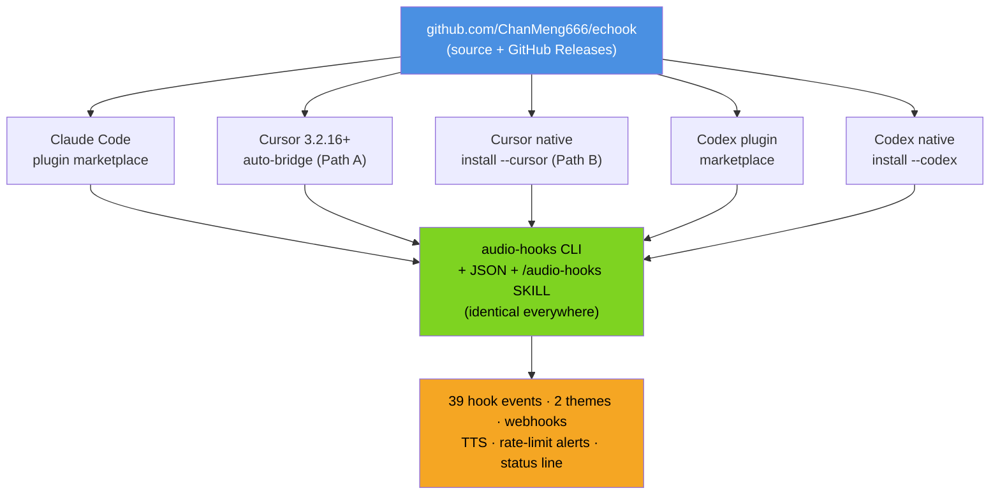
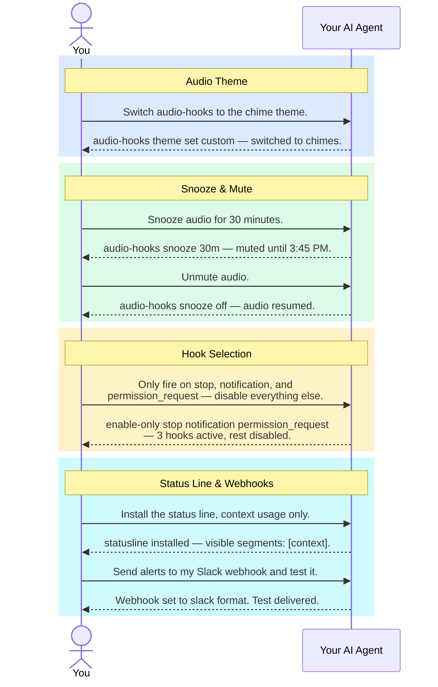
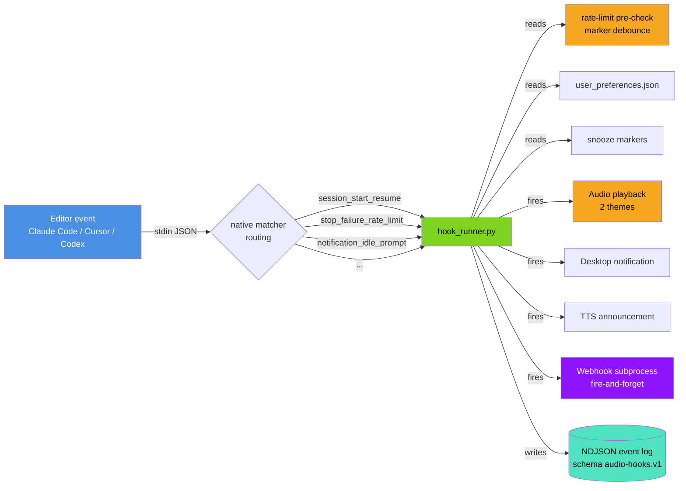

<div align="center"><a name="readme-top"></a>

[](#)

# echook

**AI-operated audio notification system for Claude Code, Cursor IDE, and Codex CLI.**<br/>
You type one slash command at install time. Then natural language forever.<br/>
Hear when your agent finishes, needs permission, or hits a rate limit — and pin a context-usage status line so you never lose your place.

<sub>**v6.2.0** — 39 hook events across all three editors · 2 audio themes · webhooks · TTS · rate-limit alerts · status line. Renamed `claude-code-audio-hooks` → **echook** (Echo + Hook) in 5.2.1; existing installs keep working. Full history in the [CHANGELOG](./CHANGELOG.md).</sub>

[](https://opensource.org/licenses/MIT)
[](https://github.com/ChanMeng666/echook/releases/latest)
[](https://github.com/ChanMeng666/echook/releases)
[](https://github.com/ChanMeng666/echook/actions/workflows/smoke.yml)
[](https://github.com/ChanMeng666/echook)
[](#get-started)
[](#get-started)

**Share This Project**

[![][share-x-shield]][share-x-link]
[![][share-linkedin-shield]][share-linkedin-link]
[![][share-reddit-shield]][share-reddit-link]
[![][share-telegram-shield]][share-telegram-link]
[![][share-whatsapp-shield]][share-whatsapp-link]

---

### Promotional Video

https://github.com/user-attachments/assets/f57249be-a524-4e6f-8225-6b9500f1aea4

<sup>Built with Remotion, Claude Code, ElevenLabs & Suno. Source: <a href="https://github.com/ChanMeng666/echook-promo-video">echook-promo-video</a></sup>

</div>

> ## 🤖 This is an AI-Agent-first project — you don't read this, your agent does
>
> **Humans: don't install or configure echook by hand.** Point your AI agent — **Claude Code, Cursor, or Codex** — at this repo and say:
>
> > *"Install echook from `github.com/ChanMeng666/echook` and set it up for me."*
>
> Your agent reads the docs, runs every command, verifies the result, and reports back. The agent-facing source of truth is [`AGENTS.md`](AGENTS.md) + [`llms.txt`](llms.txt) + the live `audio-hooks manifest`. The only thing a human ever types by hand is one `/reload-plugins` slash command (Claude Code has no CLI equivalent for it).
>
> **All a human needs to know is what echook _does_** — skim [Key Features](#key-features) below — so you can ask your agent for it in plain English: *"mute audio for an hour"*, *"switch to chimes"*, *"watch my `.env` file"*, *"put a context-usage bar in my status line"*. Not sure what's possible? Just ask your agent **"what can I configure in echook?"**

<details>
<summary><kbd>Table of Contents</kbd></summary>

- [What's New](#whats-new)
- [Key Features](#key-features)
- [Get Started](#get-started)
- [Talk to It — Natural Language Control](#talk-to-it--natural-language-control)
- [How It Works](#how-it-works)
- [Platform Support](#platform-support)
- [Help, Uninstall & Documentation](#help-uninstall--documentation)
- [License](#license)
- [Author](#author)

</details>

---

## What's New

**Latest: v6.2.0 — complete hook coverage + per-tool-type sounds on Cursor.** 13 new lifecycle events (26 → 39 total): Claude Code's `Setup` / `UserPromptExpansion` / `PostToolBatch` / `MessageDisplay`, plus Cursor's **granular per-tool-type events** so shell commands, MCP calls, and file reads each get a *distinct* sound. All new events are opt-in.

Earlier highlights: **v6.1.0** pinned the Claude Code startup banner into the status line with auto-reflow · **v6.0.0** refocused echook to two tracks (audio/notification + status line) and made every operation a non-interactive CLI command.

📜 **Full version history → [CHANGELOG.md](./CHANGELOG.md)** · [GitHub Releases](https://github.com/ChanMeng666/echook/releases)

---

## Key Features

echook does exactly two things, and does them well: **(1)** tells you *what just happened* in your AI session when you're not watching the window — a sound at your desk, a spoken summary when you're away, a desktop toast or webhook when you're in another app — and **(2)** a **status line** that keeps the facts you need pinned to the bottom of the terminal.

### 🔔 Audio & out-of-band notifications

Hear (or get pinged) the moment your agent finishes, asks for permission, fails a tool, or hits a rate limit — so you can walk away and trust you'll be called back.

| Channel | What it's for |
|---|---|
| **Audio** | A sound at your desk the instant something needs you. Two themes — voice or chimes. |
| **Desktop toast** | A glanceable popup when you're in another window. |
| **TTS** | Speaks a sanitized summary of Claude's actual final message when you're away from the screen. |
| **Webhook** | Slack / Discord / Teams / ntfy / any HTTP endpoint — get alerts on your phone. |

### 📊 Status Line — startup-banner pin + context monitor

Pins your Claude Code startup banner at the bottom (so it never scrolls away) and adds real-time **context-window** and **quota** bars — color-coded warnings before Claude enters the "agent dumb zone". Auto-reflows to fit any terminal width, so nothing is truncated.

<p align="center">

</p>

```text
[Opus 4.8 (1M context)] | 🧠 high | ⚡ CC v2.1.193 | 📁 D:\…\claude-code-audio-hooks | echook v6.2.0 | 6/39 Sounds | Theme: Voice
[MUTED 23m]  feat/audio-v5  API Quota: 78% · resets 2pm  Weekly: 82% · resets 9pm  Context: 65% (130K/200K)  /compact  💲 $0.42 +156/-23
```

| Color | Context used | Meaning | Action |
|---|---|---|---|
| 🟢 Green | < 50% | Safe — agent performs well | Keep working |
| 🟡 Yellow | 50–80% | Caution — entering the "dumb zone" | `/compact` or `/clear` soon |
| 🔴 Red | > 80% | Danger — frequent errors | `/compact` immediately |

<details>
<summary><kbd>29 customisable status-line segments</kbd></summary>
<br>

A few of the highlights (run `audio-hooks statusline segments` for the full live catalog):

| Segment | Shows |
|---|---|
| `model` | Model name (e.g. `[Opus 4.8 (1M context)]`) |
| `effort` / `thinking` | Reasoning effort (`🧠 high`) / extended-thinking flag |
| `cc_version` | Claude Code's own version (`⚡ CC v2.1.193`) |
| `cwd` / `repo` | Working directory / git remote `owner/name` |
| `session_name` / `agent` / `output_style` / `vim` | Session label / `--agent` name / output style / vim mode |
| `branch` / `git_dirty` / `worktree` | Git branch / uncommitted-change count / managed worktree |
| `pr` / `added_dirs` | Pull-request number + review state / `/add-dir` count |
| `api_quota` / `weekly_quota` | 5-hour & 7-day rate-limit bars + reset times |
| `context` / `tokens` / `exceeds_200k` | Context bar (+ tokens, `/compact` hint) / cache-hit ratio / >200K flag |
| `cost` / `duration` / `api_time` / `burn_rate` | Cost + lines diff / wall-clock time / API-wait share / $/hour |
| `version` · `sounds` · `webhook` · `theme` · `snooze` | echook version · sound count · webhook · audio theme · mute countdown |

Most richer segments self-omit when Claude Code doesn't supply their data, so a plain session stays clean. Pick segments with `visible_segments` (whitelist) or drop a few with `hidden_segments` (blacklist). Each logical line auto-reflows into as many rows as your terminal width needs — segments are never split, so nothing is cut off. Pin the width with `statusline_settings.max_width`.

> **Codex note:** Codex's status line is *not* command-backed — it only accepts a fixed list of built-in item IDs. echook can't render custom Codex segments, but it can **curate** the list so it stops truncating: `audio-hooks statusline codex apply --preset balanced`.

</details>

### 🎚️ More

| Feature | What it does |
|---|---|
| **39 hook events** | Full lifecycle coverage across Claude Code, Cursor & Codex — session start, tool use, permission requests, rate-limit warnings, and Cursor's granular shell/MCP/file events. 6 on by default; toggle any in plain English. |
| **2 audio themes** | `default` = ElevenLabs **Jessica** voice (*"Task completed"*) · `custom` = modern UI chimes. Say *"switch to chimes"*. |
| **Rate-limit alerts** | One-shot warning at 80% / 95% of your 5-hour or 7-day quota — warned once per threshold, never spammed. |
| **Webhooks** | Versioned `audio-hooks.webhook.v1` payload, fire-and-forget, never blocks a hook. |

<details>
<summary><kbd>Full hook events table (39 events)</kbd></summary>
<br>

| Hook | Default | Audio file | Native matchers |
|---|:-:|---|---|
| `notification` | on | notification-urgent.mp3 | `permission_prompt` / `idle_prompt` / `auth_success` / `elicitation_dialog` |
| `stop` | on | task-complete.mp3 | |
| `subagent_stop` | on | subagent-complete.mp3 | agent type |
| `permission_request` | on | permission-request.mp3 | tool name |
| `permission_denied` | on | permission-denied.mp3 | |
| `task_created` | on | task-created.mp3 | |
| `task_completed` | | team-task-done.mp3 | |
| `session_start` | | session-start.mp3 | `startup` / `resume` / `clear` / `compact` |
| `session_end` | | session-end.mp3 | `clear` / `resume` / `logout` / `prompt_input_exit` |
| `pretooluse` / `posttooluse` | | task-starting.mp3 / task-progress.mp3 | tool name |
| `posttoolusefailure` | | tool-failed.mp3 | tool name |
| `userpromptsubmit` | | prompt-received.mp3 | |
| `subagent_start` | | subagent-start.mp3 | agent type |
| `precompact` / `postcompact` | | notification-info.mp3 / post-compact.mp3 | `manual` / `auto` |
| `stop_failure` | | stop-failure.mp3 | `rate_limit` / `authentication_failed` / `billing_error` / `server_error` / `unknown` |
| `teammate_idle` | | teammate-idle.mp3 | |
| `config_change` · `instructions_loaded` | | config-change.mp3 · instructions-loaded.mp3 | |
| `worktree_create` / `worktree_remove` | | worktree-create.mp3 / worktree-remove.mp3 | |
| `elicitation` / `elicitation_result` | | elicitation.mp3 / elicitation-result.mp3 | |
| `cwd_changed` · `file_changed` | | cwd-changed.mp3 · file-changed.mp3 | literal filenames |
| `setup` (v6.2, Claude Code) | | setup-ready.mp3 | `init` / `maintenance` |
| `user_prompt_expansion` · `post_tool_batch` · `message_display` (v6.2) | | (per event) | |
| `shell_before` / `shell_after` (v6.2, Cursor) | | shell-starting.mp3 / shell-done.mp3 | |
| `mcp_before` / `mcp_after` (v6.2, Cursor) | | mcp-starting.mp3 / mcp-done.mp3 | |
| `file_read` · `agent_response` · `agent_thinking` · `workspace_open` · `tab_file_edit` (v6.2, Cursor) | | (per event) | |

Run `audio-hooks hooks list` for the live state, or see the [CLI & Configuration Reference](docs/CLI_REFERENCE.md).

</details>

---

## Get Started

This is an **AI-first** project — you don't follow install steps yourself. You tell your AI agent what to do in plain English, and it runs every command and reports back.



**Find your editor, paste the prompt into your agent, done:**

| Your editor / CLI | Tell your AI agent |
|---|---|
| **Claude Code** | *"Install the audio-hooks plugin from `github.com/ChanMeng666/echook`."* (Then type `/reload-plugins` once — the only manual step.) |
| **Cursor** (with Claude Code) | Nothing to install — Cursor 3.2.16+ auto-bridges the Claude Code plugin. *"Run `audio-hooks status` and confirm `editor_targets.cursor.state` is `bridged-via-claude-code`."* |
| **Cursor** (without Claude Code) | *"Clone `github.com/ChanMeng666/echook` into `~/audio-hooks`, run `python ~/audio-hooks/bin/audio-hooks install --cursor`, then verify with `audio-hooks status` + `audio-hooks test all`."* |
| **Codex** | *"Install the audio-hooks Codex plugin from `github.com/ChanMeng666/echook`, then verify with `audio-hooks status` + `audio-hooks test all`."* |

📖 **Full step-by-step install, upgrade, and verification for every path → [docs/INSTALLATION_GUIDE.md](docs/INSTALLATION_GUIDE.md).** Your agent reads this for you.

---

## Talk to It — Natural Language Control

Once installed (Claude Code, Cursor, or Codex — same CLI everywhere), every configuration is **one message**. You talk; your agent runs the right `audio-hooks` subcommand and reports back. You don't memorise anything.



A few examples — paraphrase freely:

- *"Switch to chimes"* / *"switch to voice"*
- *"Snooze audio for an hour"* / *"is audio muted?"*
- *"Enable rate-limit alerts at 80% and 95%"*
- *"Speak Claude's actual reply when done"*
- *"Watch my `.env` file for changes"*
- *"Different sound for shell commands vs MCP calls in Cursor"*
- *"Why isn't audio playing? Diagnose and fix it."*

💬 **Complete prompt reference (every option, with sequence diagrams) → [docs/NATURAL_LANGUAGE_CONTROL.md](docs/NATURAL_LANGUAGE_CONTROL.md).**

---

## How It Works



Your editor fires hook events as JSON on stdin. Native matchers route each event to `hook_runner.py`, which checks snooze state, rate-limit thresholds, debounce, and user filters — then fires audio, desktop notifications, TTS, and webhooks as configured.

🏗️ **Internals, hook lifecycle, path resolution, and the build pipeline → [docs/ARCHITECTURE.md](docs/ARCHITECTURE.md).**

---

## Platform Support

| Platform | Audio player | Status |
|---|---|---|
| **Windows** (PowerShell / Git Bash / WSL2) | PowerShell MediaPlayer | ✅ Fully supported |
| **macOS** | `afplay` | ✅ Fully supported |
| **Linux** | `mpg123` / `ffplay` / `paplay` / `aplay` (auto-detected) | ✅ Fully supported |

Python 3.6+ is the only runtime requirement.

---

## Help, Uninstall & Documentation

> **Agents start here:** read [`AGENTS.md`](AGENTS.md) (mirrored as [`CLAUDE.md`](CLAUDE.md)) or [`llms.txt`](llms.txt), then run `audio-hooks manifest` — the complete, live, truthful state of the project. Everything below is for curious humans.

- **Something wrong?** Just say *"audio-hooks isn't working, diagnose and fix it"* — or see [docs/TROUBLESHOOTING.md](docs/TROUBLESHOOTING.md).
- **Uninstall?** Say *"uninstall audio-hooks completely."* Details in the [Installation Guide](docs/INSTALLATION_GUIDE.md).
- **Want to contribute?** See [CONTRIBUTING.md](CONTRIBUTING.md) for the canonical-source workflow.

| Document | Purpose |
|---|---|
| [**AGENTS.md**](AGENTS.md) / [**CLAUDE.md**](CLAUDE.md) | Agent-facing operating guide — critical rules (CLI-only, manifest-first, two-track scope) |
| [**llms.txt**](llms.txt) | AI-agent entrypoint |
| [**docs/INSTALLATION_GUIDE.md**](docs/INSTALLATION_GUIDE.md) | Full install / upgrade / uninstall for Claude Code, Cursor & Codex |
| [**docs/NATURAL_LANGUAGE_CONTROL.md**](docs/NATURAL_LANGUAGE_CONTROL.md) | Every natural-language prompt, with diagrams |
| [**docs/CLI_REFERENCE.md**](docs/CLI_REFERENCE.md) | CLI subcommands, config keys, env vars, error codes, logging |
| [**docs/ARCHITECTURE.md**](docs/ARCHITECTURE.md) | System architecture and design decisions |
| [**docs/TROUBLESHOOTING.md**](docs/TROUBLESHOOTING.md) | Diagnostic recipes for common issues |
| [**CHANGELOG.md**](CHANGELOG.md) | Detailed version history |
| `audio-hooks manifest` | Live source of truth — subcommands, hooks, config keys, error codes, env vars, editor targets. Always current. |

---

<table>
<tr>
<td>

**Design Philosophy** — This project is **AI-operated**, not AI-assisted. A typical CLI tool: the human learns the tool. **echook**: the human says what they want, and the AI agent learns the tool and does the work. The human is **upstream** of the agent, not downstream of the CLI.

</td>
</tr>
</table>

---

## License

This project is licensed under the **MIT License** — see [LICENSE](LICENSE) for details. Commercial use, modification, distribution, and private use all allowed.

---

## Author

<div align="center">
  <table>
    <tr>
      <td align="center">
        <a href="https://github.com/ChanMeng666">
          
          <br />
          <sub><b>Chan Meng</b></sub>
        </a>
        <br />
        <small>Creator & Lead Developer</small>
      </td>
    </tr>
  </table>
</div>

<p align="center">
  <a href="https://github.com/ChanMeng666">
    
  </a>
  <a href="https://www.linkedin.com/in/chanmeng666/">
    
  </a>
  <a href="https://chanmeng.org/">
    
  </a>
</p>

<p align="center">
  <a href="https://buymeacoffee.com/chanmeng66u" target="_blank">
    
  </a>
</p>

---

<div align="right">

[![][back-to-top]](#readme-top)

</div>

<!-- LINK DEFINITIONS -->

[back-to-top]: https://img.shields.io/badge/-BACK_TO_TOP-black?style=flat-square

[share-x-shield]: https://img.shields.io/badge/-Share%20on%20X-black?labelColor=black&logo=x&logoColor=white&style=flat-square
[share-x-link]: https://x.com/intent/tweet?text=Check%20out%20echook%20-%20AI-operated%20audio%20notifications%20for%20Claude%20Code%2C%20Cursor%20%26%20Codex&url=https%3A%2F%2Fgithub.com%2FChanMeng666%2Fechook

[share-linkedin-shield]: https://img.shields.io/badge/-Share%20on%20LinkedIn-blue?labelColor=blue&logo=linkedin&logoColor=white&style=flat-square
[share-linkedin-link]: https://www.linkedin.com/sharing/share-offsite/?url=https%3A%2F%2Fgithub.com%2FChanMeng666%2Fechook

[share-reddit-shield]: https://img.shields.io/badge/-Share%20on%20Reddit-orange?labelColor=black&logo=reddit&logoColor=white&style=flat-square
[share-reddit-link]: https://www.reddit.com/submit?title=echook%20-%20AI-operated%20audio%20notifications&url=https%3A%2F%2Fgithub.com%2FChanMeng666%2Fechook

[share-telegram-shield]: https://img.shields.io/badge/-Share%20on%20Telegram-blue?labelColor=blue&logo=telegram&logoColor=white&style=flat-square
[share-telegram-link]: https://t.me/share/url?text=echook%20-%20AI-operated%20audio%20notifications&url=https%3A%2F%2Fgithub.com%2FChanMeng666%2Fechook

[share-whatsapp-shield]: https://img.shields.io/badge/-Share%20on%20WhatsApp-green?labelColor=green&logo=whatsapp&logoColor=white&style=flat-square
[share-whatsapp-link]: https://api.whatsapp.com/send?text=Check%20out%20echook%20-%20AI-operated%20audio%20notifications%20for%20Claude%20Code%2C%20Cursor%20%26%20Codex%20https%3A%2F%2Fgithub.com%2FChanMeng666%2Fechook

---

<!-- CHAN MENG PERSONAL BRAND -->
<div align="center">
  <a href="https://github.com/ChanMeng666" target="_blank">
    
  </a>

  <p><strong>Chan Meng</strong><br/>Need a custom app like this one? I build them — let's talk.</p>

  <a href="mailto:chanmeng.dev@gmail.com"></a>
  <a href="https://github.com/ChanMeng666"></a>
</div>
<!-- /CHAN MENG PERSONAL BRAND -->
