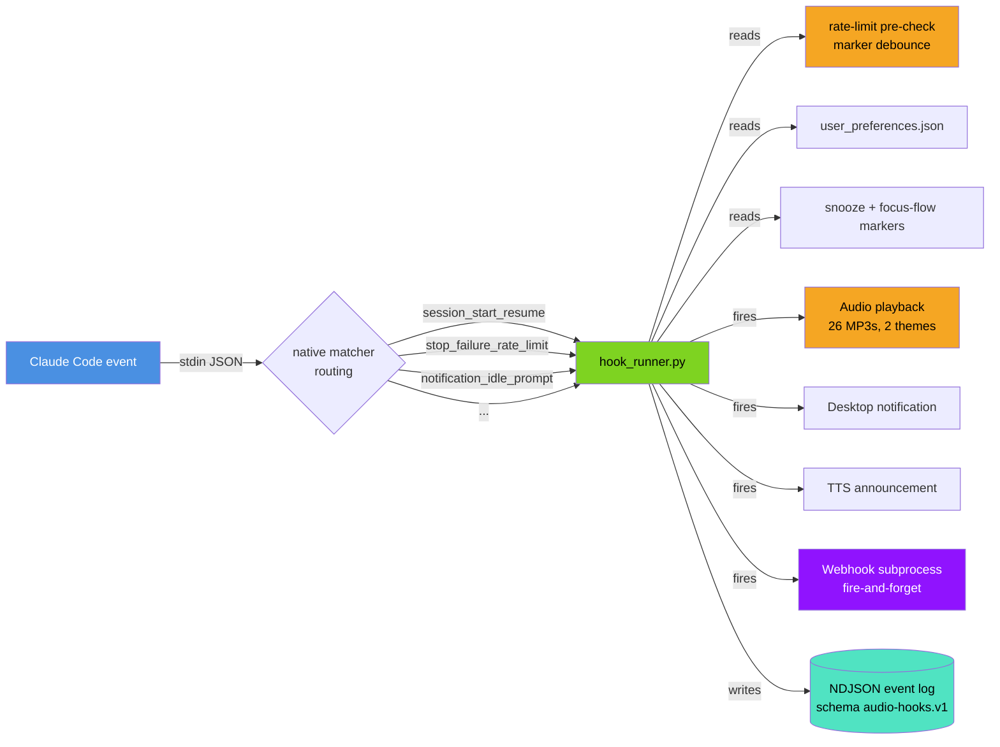
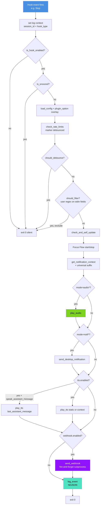
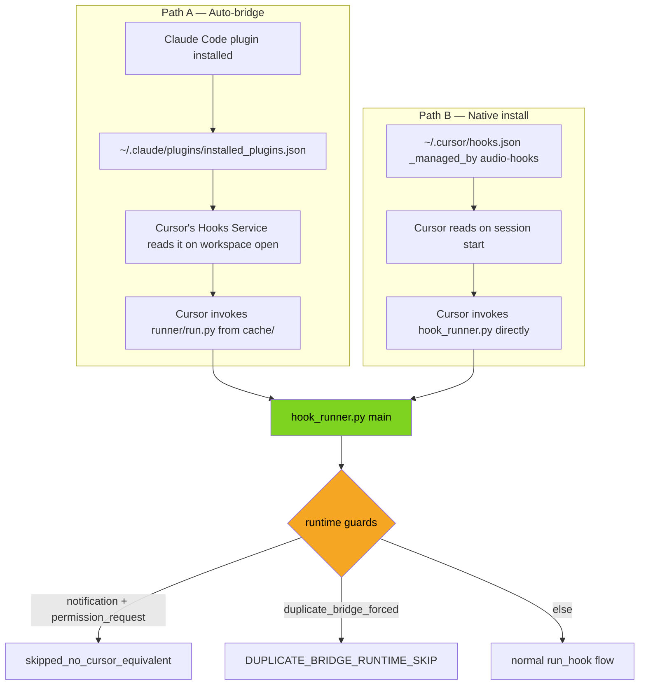
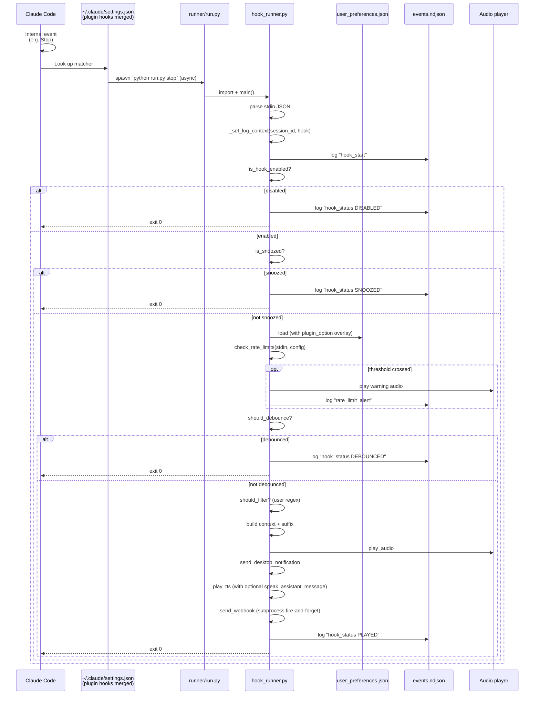
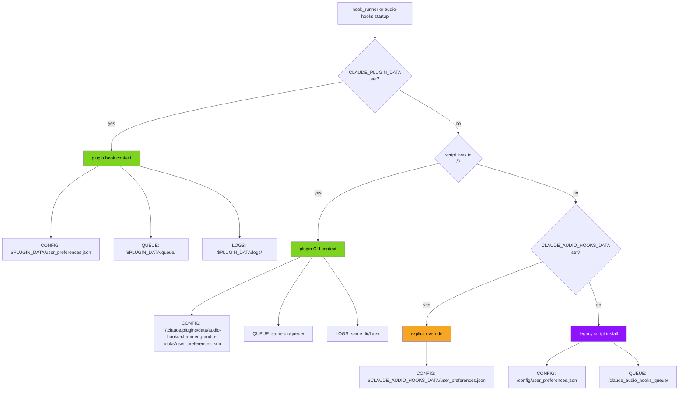
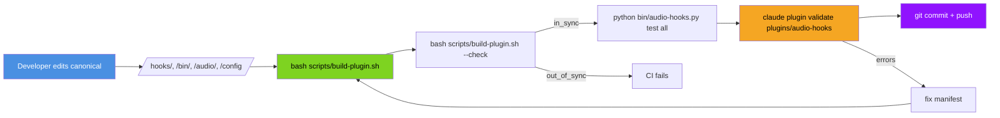

# System Architecture

> **Version:** 5.2.0 | **Last Updated:** 2026-05-04

This document explains the technical architecture of claude-code-audio-hooks. It is the developer-facing deep dive — for operating the project, see [CLAUDE.md](../CLAUDE.md) (the canonical AI doc) or [README.md](../README.md). For the live machine description of every subcommand and config key, run `audio-hooks manifest`.

> **5.2.0 update:** Codex CLI lands as a third editor target. New `hooks/invoker.py` module extracted from `hook_runner.py` so `user_preferences.py` can ask "which IDE invoked us?" without a circular import. The runner now consumes a `--invoker codex` CLI flag (Codex sets no env var we could detect by, unlike Cursor's `CURSOR_VERSION`); the install template at `codex-hooks/hooks.json` bakes the flag into every command. `_resolve_data_dir()` gains a Codex-gated step at priority 3 (between the env-var overrides and the plugin-cache layout) that lands at `$CODEX_HOME/audio-hooks-data/` when `detect_invoker() == "codex"`. The `run_hook` runtime no-ops the 18 audio-hooks canonical events with no Codex equivalent. AI-first feature-flag handling: install authors a fresh `~/.codex/config.toml` with `[features].codex_hooks = true` when none exists, and emits machine-readable `next_steps` for the calling AI agent to follow up when an existing one needs editing — we never round-trip user-authored TOML.

> **5.1.5 update:** `hooks/user_preferences.py` is now the single source of truth for `user_preferences.json` access. `hook_runner.py` and `bin/audio-hooks.py` consolidated onto it via `get_prefs()` (lazy module-level singleton), eliminating the dual-implementation drift class that produced the 5.1.4 anti-stranding bug. The class owns 6-level path resolution, load with auto-migration (deep-merge missing keys from template; user values win on conflicts), atomic save under cross-platform file lock, and dual-location backups (`<data>/user_preferences.json.bak` for last-good + `~/.claude-audio-hooks-backups/<plugin_id>/<ts>.json` for disaster recovery, kept outside `~/.claude/plugins/data/` so `claude plugin uninstall` cannot wipe them). New `audio-hooks upgrade` and `audio-hooks backup *` subcommands wrap these mechanics for AI operators.

## Design constraints

The project is **AI-operated**, not human-operated:

1. **No interactive CLI prompts.** All scripts auto-engage non-interactive mode on non-TTY or when `CLAUDE_NONINTERACTIVE=1` is set.
2. **No human-readable error logs.** All logs are NDJSON (`audio-hooks.v1` schema) with stable `code` enums and machine-actionable `hint` + `suggested_command` fields.
3. **No GUIs.**
4. **No 2FA / CAPTCHA gates.**
5. **Every config knob is settable in one shot** via `audio-hooks set` or a typed setter.
6. **Every state read returns a single JSON document** in <100ms.
7. **All documentation that Claude Code reads is self-contained, structured, and current.**
8. **Single monolith, one repo, one codebase.** No microservices. The plugin lives inside the same repo as a subdirectory.

## High-level architecture



## Components

### 1. `hooks/hook_runner.py` (canonical, ~1700 lines)

The Python hook runner is the **single source of truth** for hook event handling. It is invoked in two ways:

| Invocation | Trigger | `CLAUDE_PLUGIN_DATA` set? |
|---|---|---|
| Plugin install | `${CLAUDE_PLUGIN_ROOT}/runner/run.py <event>` from `hooks/hooks.json` | yes |
| Script install | `python ~/.claude/hooks/hook_runner.py <event>` from `~/.claude/settings.json` | no |

The runner accepts both **canonical hook names** (`stop`, `notification`, `session_start`) and **synthetic matcher variants** (`session_start_resume`, `stop_failure_rate_limit`, `notification_idle_prompt`). Synthetic names are mapped to a canonical hook plus a per-variant audio override via `SYNTHETIC_EVENT_MAP`.

**Per-invocation flow:**



**Key functions:**

| Function | Purpose |
|---|---|
| `_resolve_synthetic_event(raw_arg)` | Maps synthetic names to canonical + audio override |
| `_resolve_config_file()` | Resolves `user_preferences.json` path: `CLAUDE_PLUGIN_DATA` → plugin context detection → explicit override → legacy script path |
| `_apply_plugin_option_overlay(config)` | Overlays `CLAUDE_PLUGIN_OPTION_*` env vars onto loaded config |
| `is_hook_enabled(hook_type)` | Reads `enabled_hooks.<name>` with v5.0 default-on for `permission_denied` and `task_created` |
| `is_snoozed()` | Reads marker file at `${QUEUE_DIR}/snooze_until` |
| `should_debounce(hook_type)` | Per-hook debounce marker |
| `should_filter(hook_type, stdin, config)` | User-defined regex filters on stdin fields |
| `check_rate_limits(stdin, config)` | v5.0: inspects `rate_limits` field, fires one-shot warning per `(window, threshold, resets_at)` |
| `get_notification_context(hook, stdin, level)` | Builds the notification text with v5.0 enrichment (last_assistant_message, worktree, agent, etc.) |
| `_format_context_suffix(stdin, level)` | Universal `[session: foo, worktree: bar]` suffix |
| `play_audio(file)` | Platform dispatch: `play_audio_windows` / `_macos` / `_linux` / `_wsl` |
| `send_desktop_notification(title, msg, urgency)` | Platform dispatch: osascript / notify-send / PowerShell NotifyIcon |
| `play_tts(message)` | Platform dispatch: `say` / `espeak` / `spd-say` / SAPI |
| `send_webhook(...)` | v5.0: fire-and-forget via subprocess.Popen so parent exits immediately |
| `log_event(level, action, **fields)` | NDJSON writer with stable schema, log rotation 5MB / 3 files |
| `log_error_event(code, action, ...)` | Adds `error.code` + `error.hint` + `error.suggested_command` |

### 2. `bin/audio-hooks` (canonical CLI)

Three files:

| File | Role |
|---|---|
| `bin/audio-hooks.py` | Python entry point (~1100 lines), 27 subcommands |
| `bin/audio-hooks` | Bash wrapper that probes `python3` / `python` / `py` and exec's the .py file. Skips Microsoft Store python3 stub on Windows. |
| `bin/audio-hooks.cmd` | Windows shim that runs `python audio-hooks.py %*` |

The bash wrapper exists because Git Bash on Windows doesn't reliably handle Python shebangs and the Microsoft Store python3 stub at `WindowsApps\python3.exe` exits 49 silently when invoked. The wrapper probes each candidate with a `-c "import sys"` test and skips broken stubs.

**Subcommand dispatch table** lives at the bottom of `audio-hooks.py` (the `DISPATCH` dict). Adding a new subcommand: write `cmd_<name>(args) -> int`, add to `DISPATCH`, add an entry to `_build_manifest()`'s `subcommands` list.

**Plugin context detection** (`_is_running_from_plugin()`): the binary lives at `<plugin_root>/bin/audio-hooks.py` when invoked from a plugin install. We detect this by checking for `<plugin_root>/.claude-plugin/plugin.json`. When detected, `_config_path()` resolves to `~/.claude/plugins/data/audio-hooks-chanmeng-audio-hooks/user_preferences.json` (the canonical plugin data dir per Claude Code's docs) and auto-initialises from `default_preferences.json` on first read.

### 3. `plugins/audio-hooks/` (Claude Code plugin)

Self-contained plugin layout, populated by `bash scripts/build-plugin.sh` from the canonical sources.

```
plugins/audio-hooks/
├── .claude-plugin/
│   └── plugin.json              # name, version, userConfig
├── hooks/
│   ├── hooks.json               # matcher-scoped hook registration (auto-discovered)
│   └── hook_runner.py           # copy of /hooks/hook_runner.py
├── runner/
│   └── run.py                   # imports bundled hook_runner.py and dispatches
├── skills/
│   └── audio-hooks/
│       └── SKILL.md             # natural-language activation
├── bin/
│   ├── audio-hooks              # bash wrapper
│   ├── audio-hooks.py           # Python entry
│   └── audio-hooks.cmd          # Windows shim
├── audio/
│   ├── default/                 # 26 voice files
│   └── custom/                  # 26 chime files
└── config/
    └── default_preferences.json # template (auto-copied to plugin data dir)
```

**`hooks/hooks.json`** registers per-matcher handlers using synthetic event names:

```jsonc
{
  "hooks": {
    "Notification": [
      { "matcher": "permission_prompt",
        "hooks": [{ "type": "command",
                    "command": "python \"${CLAUDE_PLUGIN_ROOT}/runner/run.py\" notification_permission_prompt",
                    "async": true, "timeout": 10 }] },
      { "matcher": "idle_prompt",      "hooks": [...] },
      { "matcher": "auth_success",     "hooks": [...] },
      { "matcher": "elicitation_dialog","hooks": [...] }
    ],
    "SessionStart": [
      { "matcher": "startup", "hooks": [...session_start_startup] },
      { "matcher": "resume",  "hooks": [...session_start_resume] },
      { "matcher": "clear",   "hooks": [...session_start_clear] },
      { "matcher": "compact", "hooks": [...session_start_compact] }
    ],
    "StopFailure": [
      { "matcher": "rate_limit",            "hooks": [...stop_failure_rate_limit] },
      { "matcher": "authentication_failed", "hooks": [...stop_failure_authentication_failed] },
      { "matcher": "billing_error|invalid_request|server_error|max_output_tokens|unknown",
        "hooks": [...stop_failure_other] }
    ]
    // ... and so on for all 25 events
  }
}
```

Native matcher routing happens at the `settings.json` layer (Claude Code's matcher engine), not inside Python branching. Faster, configurable per-matcher, and per-handler `async: true` means a slow rate-limit-failure path doesn't block the auth-failure path.

**Auto-discovery**: don't put `"hooks": "./hooks/hooks.json"` in `plugin.json` — Claude Code auto-discovers `hooks/hooks.json` from the standard location, and declaring it twice causes "Duplicate hooks file detected" load errors.

**`runner/run.py`** is a thin wrapper that walks up from its own directory looking for `hooks/hook_runner.py` (which is bundled inside the plugin), inserts that path into `sys.path`, and calls `hook_runner.main()`.

**`skills/audio-hooks/SKILL.md`** is the natural-language activation surface. YAML frontmatter declares trigger phrases like *"snooze audio"*, *"configure audio hooks"*, *"why is there no sound"*. When Claude detects an intent matching one of these, it loads the SKILL body which is a structured prose-and-table guide telling Claude exactly which `audio-hooks` subcommand to run for any user request. The golden rule baked into the SKILL: **always run `audio-hooks manifest` first** if you're unsure of the project's current surface area.

### 4. `bin/audio-hooks-statusline` (Claude Code status line)

Two-line bottom bar registered in `~/.claude/settings.json` via `audio-hooks statusline install`. Reads stdin JSON Claude Code provides (model name, session_id, workspace.git_worktree, rate_limits, context_window) and emits two lines of plain text with ANSI colors:

```text
[Opus] 🔊 Audio Hooks v5.1.3 | 6/26 Sounds | Webhook: ntfy | Theme: Voice
[MUTED 23m]  🌿 feat/audio-v5  ████░░░░ API Quota: 78%  █████░░░ Context: 65% (130K/200K) ⚠️ /compact
```

The API Quota bar uses thresholds GREEN <70%, YELLOW 70-89%, RED ≥90%. The Context bar uses agent-safety thresholds: GREEN <50% (safe), YELLOW 50-80% (should `/compact`), RED >80% (agent "dumb zone"). Actionable hints (`⚠️ /compact` or `🛑 /compact`) appear in yellow/red zones.

**Context segment numerator (v5.1.3+).** When Claude Code's stdin JSON includes both `context_window.used_percentage` and `context_window.context_window_size`, the segment appends absolute counts via `_fmt_tokens()`, e.g. `Context: 83% (166K/200K)`. The numerator is **derived** as `int(round(used_percentage × context_window_size / 100))` — we deliberately do NOT use the `total_input_tokens` field from the JSON because it counts only literal input tokens (excluding `cache_read_input_tokens` / `cache_creation_input_tokens`), which understates real context usage by ~30× in cache-heavy sessions like Claude Code itself. Deriving from the percentage guarantees the displayed math is internally self-consistent. When `context_window_size` is missing, malformed, or non-positive, the segment falls back silently to the pre-5.1.3 form `Context: 83%`. Regression-guarded by `tests/test_statusline.py::TestContextSegment`.

**Diagnostic dump (v5.1.3+).** Setting `CLAUDE_HOOKS_DEBUG=1` (or `true`/`yes`, case-insensitive — matches `hook_runner.DEBUG`) causes the script to atomically write the most recent stdin JSON to `${state_dir}/statusline.last_input.json` via per-PID tempfile + `os.replace`. Used to diagnose what Claude Code is actually piping (e.g. confirming whether `context_window_size` updated after a `/model` change). Privacy note: the dump may include workspace paths, transcript path, and the last assistant message — disable when not actively diagnosing.

Users can customise which segments appear via `statusline_settings.visible_segments` (array of segment names). 10 segments available — Line 1: `model`, `version`, `sounds`, `webhook`, `theme`; Line 2: `snooze`, `focus`, `branch`, `api_quota`, `context`. Empty array (default) shows all. Example: `audio-hooks set statusline_settings.visible_segments '["context","api_quota"]'` shows only the two progress bars.

`refreshInterval: 60` is set in the registration so snooze countdowns, rate-limit bars, and context usage bars update during idle periods. The script caches `audio-hooks status` for 5 seconds keyed on `session_id` to keep render time <100ms.

### 5. `scripts/`

| Script | Purpose | AI-callable? |
|---|---|---|
| `install-complete.sh` | Legacy script install | yes (auto non-interactive on non-TTY) |
| `install-windows.ps1` | PowerShell installer for Windows | yes |
| `quick-setup.sh` | Lite tier (zero deps, no Python) | yes |
| `quick-configure.sh` | Lite tier hook toggling | yes |
| `quick-unsetup.sh` | Lite tier uninstall | yes |
| `snooze.sh` | Legacy snooze CLI | yes (`audio-hooks snooze` is preferred) |
| `uninstall.sh` | Legacy uninstall | yes (auto non-interactive, `--purge` for full removal) |
| `build-plugin.sh` | Sync canonical → plugin layout | yes (NDJSON output, `--check` flag for CI) |
| `generate-audio.py` | ElevenLabs audio generator | yes (NDJSON output, `--force` / `--only` / `--dry-run`) |
| `configure.sh` | Human-only menu | **no** — auto-redirects to `audio-hooks` via `INTERACTIVE_SCRIPT` JSON pointer when invoked non-interactively |
| `test-audio.sh` | Human-only menu | **no** — same |
| `diagnose.py` | Legacy diagnose | yes (`audio-hooks diagnose` is preferred) |

### 6. Cursor IDE integration (5.1.4+, hardened in 5.1.6)

Cursor IDE 3.2.16+ is a first-class invoker for this project. The integration has two distinct paths, each with different runtime invariants:



**Path A: auto-bridge (most users).** Cursor 3.2.16+ scans `~/.claude/plugins/installed_plugins.json` on every workspace open and registers the plugin's `hooks/hooks.json` events as Cursor's own session hooks. Cursor invokes `~/.claude/plugins/cache/chanmeng-audio-hooks/audio-hooks/<ver>/runner/run.py` on its own session events, but **does not inject `CLAUDE_PLUGIN_DATA`** and **does not pass through Claude Code's stdin schema** — Cursor uses its own (camelCase event names, fields like `cursor_version`, `conversation_id`, `final_status`, `duration_ms`, `is_background_agent`, `workspace_roots`, `model`, `error_message`, plus compat fields `session_id`, `hook_event_name`, `transcript_path`).

**Path B: native install (Cursor without Claude Code).** `audio-hooks install --cursor` writes `~/.cursor/hooks.json` from the canonical template at `cursor-hooks/hooks.json`, substituting `{{PYTHON}}` and `{{HOOK_RUNNER}}` with absolute paths. The substituted JSON is the source of truth: every event entry is tagged `"_managed_by": "audio-hooks"` so `uninstall --cursor` can scope its cleanup. Backslashes in Windows paths are JSON-escaped before substitution (5.1.6 fix; pre-5.1.6 substituted raw, producing invalid JSON).

**Bridge mapping (Cursor's responsibility, per [cursor.com/docs/reference/third-party-hooks](https://cursor.com/docs/reference/third-party-hooks)):**

| Claude Code | Cursor | Bridge |
|---|---|---|
| PreToolUse | preToolUse | yes |
| PostToolUse | postToolUse | yes |
| UserPromptSubmit | beforeSubmitPrompt | yes |
| Stop | stop | yes |
| SubagentStop | subagentStop | yes |
| SessionStart | sessionStart | yes |
| SessionEnd | sessionEnd | yes |
| PreCompact | preCompact | yes |
| Notification | — | NO Cursor equivalent |
| PermissionRequest | — | NO Cursor equivalent |

`subagentStart`, `postToolUseFailure`, and `afterFileEdit` are **Cursor-native events** — they exist in Cursor but have no Claude Code equivalent and so cannot be auto-bridged. The Path B template registers them; the Path A bridge cannot.

**Tool-name mapping (Cursor side):** `Bash`→`Shell`, `Edit`→`Write`. `Glob` / `WebFetch` / `WebSearch` matchers do not fire under Cursor (Cursor lacks these tool types).

**Key components:**

| Function | Location | Purpose |
|---|---|---|
| `detect_invoker()` | `hooks/hook_runner.py` | Returns `"claude-code"` / `"cursor"` / `"unknown"` from env vars (`CURSOR_VERSION`, `CLAUDE_PLUGIN_DATA`, `CLAUDE_PLUGIN_ROOT`). Cursor wins when both are set. Cached per-process via `_invoker_cache`. |
| `UserPreferences._resolve_data_dir()` | `hooks/user_preferences.py` | 6-level fallback chain: `CLAUDE_PLUGIN_DATA` → `CLAUDE_AUDIO_HOOKS_DATA` → plugin-cache detection → `~/.claude/plugins/data/<id>/` (if user_preferences.json exists) → `~/.cursor/audio-hooks-data/` (if user_preferences.json exists) → legacy temp dir. The Cursor branch is the 5.1.4 anti-stranding fix. |
| `session_start` env-emit | `hooks/hook_runner.py:main()` | When invoker is Cursor, writes `{"env": {"CLAUDE_PLUGIN_DATA": "<path>"}}` to stdout. Per Cursor's docs, `sessionStart` env outputs propagate to every subsequent hook in the session — so all later hooks see the right path without depending on the runtime fallback. Silent when invoker is not Cursor. |
| `_read_install_marker()` | `hooks/hook_runner.py` | Reads `${data_dir}/install_marker.json` once per process (cached as `{}` on miss). Used by the runtime double-fire guard. |
| `run_hook()` runtime guards | `hooks/hook_runner.py` | (1) If invoker is Cursor and hook is `notification`/`permission_request`: log `skipped_no_cursor_equivalent` and exit 0. (2) If invoker is Cursor and `duplicate_bridge_forced: true`: log `duplicate_bridge_runtime_skip` (`DUPLICATE_BRIDGE_RUNTIME_SKIP`) and exit 0. Both guards run before any audio/notification/webhook firing. |
| `_install_cursor` / `_uninstall_cursor` | `bin/audio-hooks.py` | Path B installer. Detects DUPLICATE_BRIDGE via `_detect_install_mode()` (reads `~/.claude/plugins/installed_plugins.json`). `--force` overrides the abort and stamps `duplicate_bridge_forced: true` in the install marker. Uninstall removes only `_managed_by: audio-hooks` entries; `--purge` deletes `~/.cursor/audio-hooks-data/` too. |
| `_detect_editor_targets()` | `bin/audio-hooks.py` | Reports per-editor state: `active` / `bridged-via-claude-code` / `native` / `double-registered` / `inactive`. Surfaced in `status`, `diagnose`, and `manifest` output. |

**Webhook payload extensions:** when invoker is Cursor, the raw payload includes `invoker: "cursor"` plus a `cursor: {...}` sub-object surfacing the Cursor-specific stdin fields. `user_email` is **redacted by default** (`webhook_settings.include_user_email` opt-in flag; off because the webhook URL may be third-party).

**NDJSON event log:** every event includes an `invoker` field for cross-IDE filtering. `audio-hooks logs tail --invoker cursor` is the canonical filter (also reachable as a `jq` query against `events.ndjson`).

**Test contract:** `tests/test_cursor_bridge.py` (32 cases as of 5.1.6) pins all of the above as invariants. Adding a new bridge-relevant code path? Add a regression test there.

## Hook event lifecycle (full detail)



## Path resolution



The plugin data dir is at `~/.claude/plugins/data/{id}/` where `{id}` is the plugin name with non-alnum chars replaced by `-`. For `audio-hooks@chanmeng-audio-hooks` the id is `audio-hooks-chanmeng-audio-hooks`.

## NDJSON event log

Schema: `audio-hooks.v1`. One JSON object per line. Event types are stable.

| `action` | `level` | When |
|---|---|---|
| `hook_start` | `debug` | Every hook invocation, with `synthetic_variant` if matcher-routed |
| `hook_status` | `info` | Final status: `PLAYED`, `DISABLED`, `SNOOZED`, `DEBOUNCED`, `FILTERED`, `NO_AUDIO_CONFIG`, `FILE_NOT_FOUND`, `PLAY_FAILED` |
| `rate_limit_alert` | `warn` | Rate-limit threshold crossed; includes `window`, `threshold`, `used_percentage`, `resets_at` |
| `tts_spoken` | `info` | TTS dispatched |
| `webhook_dispatched` | `info` | Webhook subprocess spawned |
| `audio_override_resolved` | `debug` | Synthetic matcher variant resolved an audio override |
| `play_audio` | `info` | Audio successfully dispatched to platform player |
| `legacy_error` | `error` | Caught from `log_error()` legacy wrapper |
| `lookup_audio` | `error` | `AUDIO_FILE_MISSING` |
| `webhook_dispatch` | `error` | `WEBHOOK_TIMEOUT` or `WEBHOOK_HTTP_ERROR` |

Error events carry an `error` object with `code` (stable enum), `message`, `hint`, and optionally `suggested_command`.

## Stable error code enum

Defined in `hook_runner.py`'s `ErrorCode` class. Add new codes here, never rename existing ones.

```python
class ErrorCode:
    AUDIO_FILE_MISSING = "AUDIO_FILE_MISSING"
    AUDIO_PLAYER_NOT_FOUND = "AUDIO_PLAYER_NOT_FOUND"
    AUDIO_PLAY_FAILED = "AUDIO_PLAY_FAILED"
    INVALID_CONFIG = "INVALID_CONFIG"
    CONFIG_READ_ERROR = "CONFIG_READ_ERROR"
    WEBHOOK_HTTP_ERROR = "WEBHOOK_HTTP_ERROR"
    WEBHOOK_TIMEOUT = "WEBHOOK_TIMEOUT"
    NOTIFICATION_FAILED = "NOTIFICATION_FAILED"
    TTS_FAILED = "TTS_FAILED"
    SETTINGS_DISABLE_ALL_HOOKS = "SETTINGS_DISABLE_ALL_HOOKS"
    PROJECT_DIR_NOT_FOUND = "PROJECT_DIR_NOT_FOUND"
    SELF_UPDATE_FAILED = "SELF_UPDATE_FAILED"
    UNKNOWN_HOOK_TYPE = "UNKNOWN_HOOK_TYPE"
    INTERNAL_ERROR = "INTERNAL_ERROR"
```

The `bin/audio-hooks.py` `cmd_diagnose` function adds two more codes that are CLI-specific (not from hook_runner): `DUAL_INSTALL_DETECTED` and `INTERACTIVE_SCRIPT`.

`_ERROR_HINTS` (a dict in `hook_runner.py`) maps each code to a `hint` (one sentence) and `suggested_command` (a literal `audio-hooks ...` command). When `log_error_event(code, action, message)` is called, the resulting NDJSON event has the full error object populated automatically.

## Backwards compatibility

| Pre-v5.0 surface | v5.0.1 status |
|---|---|
| `~/.claude/settings.json` legacy hook entries (`Notification`, `Stop`, `SubagentStop`, `PermissionRequest`) | Still work — canonical hook names resolve in `hook_runner.main()` |
| Free-text `debug.log`, `errors.log`, `hook_triggers.log` | Replaced by `events.ndjson`. Legacy `log_debug`/`log_error`/`log_trigger` are now thin NDJSON wrappers. |
| `<project>/config/user_preferences.json` (script install) | Still the resolution target for legacy script installs |
| `bash scripts/install-complete.sh` interactive mode | Still works for human users; auto non-interactive on non-TTY |
| `scripts/snooze.sh` CLI | Still works; `audio-hooks snooze` is preferred |
| `scripts/diagnose.py` | Still works; `audio-hooks diagnose` is preferred (returns JSON) |
| Pre-v5 `user_preferences.json` schema | Forward-compatible — new keys are optional with sensible defaults |

## Build pipeline



## Adding a new hook event (when Claude Code adds one)

1. Add the canonical name + audio filename to `DEFAULT_AUDIO_FILES` and `CUSTOM_AUDIO_FILES` in `hook_runner.py`.
2. Add a branch in `get_notification_context(hook_type, ...)` for the notification text.
3. Add the entry to `HOOK_CATALOG` in `bin/audio-hooks.py`.
4. Add an entry to `enabled_hooks` in `config/default_preferences.json` (with default on/off).
5. Add the event handler to `plugins/audio-hooks/hooks/hooks.json` (with matchers if applicable).
6. If matcher-scoped, add synthetic event entries to `SYNTHETIC_EVENT_MAP` in `hook_runner.py`.
7. Add audio entries to `config/audio_manifest.json` and run `python scripts/generate-audio.py`.
8. Run `bash scripts/build-plugin.sh`.
9. Test: `python bin/audio-hooks.py test <new_hook>`.
10. Update `CLAUDE.md` and `README.md` hook tables. Bump version, update CHANGELOG.

## Adding a new audio file

1. Add an entry to `config/audio_manifest.json`: `filename`, `theme`, `type` (`voice` or `sound_effect`), `text` prompt.
2. `ELEVENLABS_API_KEY=... python scripts/generate-audio.py --only <new_file>`.
3. `bash scripts/build-plugin.sh`.
4. Commit the new MP3 + manifest entry.

## Testing locally

```bash
# From a fresh terminal — verify the binary works
python bin/audio-hooks.py manifest
python bin/audio-hooks.py status
python bin/audio-hooks.py test all
python bin/audio-hooks.py diagnose

# Verify the plugin layout
bash scripts/build-plugin.sh --check
claude plugin validate plugins/audio-hooks

# Run the unit-test suite (stdlib-only, no extra deps)
python -m unittest discover tests

# Verify a specific hook with mock stdin
echo '{"session_id":"t","hook_event_name":"Stop","last_assistant_message":"test"}' | \
  python hooks/hook_runner.py stop

# Test rate-limit alert
echo '{"session_id":"t","rate_limits":{"five_hour":{"used_percentage":85,"resets_at":9999999999}}}' | \
  python hooks/hook_runner.py stop

# Test the status line (Sonnet-after-/model-switch case)
echo '{"session_id":"t","model":{"display_name":"Sonnet"},"context_window":{"used_percentage":83,"context_window_size":200000}}' | \
  python bin/audio-hooks-statusline.py
```

The `tests/` directory is wired into `.github/workflows/smoke.yml` and runs on every push/PR across the 9-job matrix (Ubuntu / Windows / macOS × Python 3.9 / 3.12 / 3.13). Adding new tests there is the canonical way to pin behavioural contracts.

## See also

- [CLAUDE.md](../CLAUDE.md) — canonical AI-facing operating guide
- [README.md](../README.md) — public-facing project introduction
- [CHANGELOG.md](../CHANGELOG.md) — version history including the v5.0/v5.0.1 detail
- `audio-hooks manifest` — live machine description of every subcommand and config key
