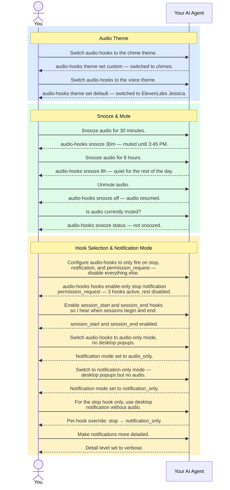
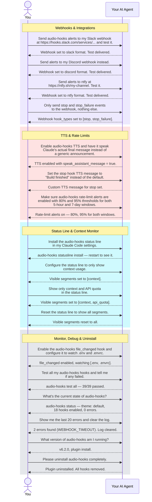

# Natural-Language Control

echook is **AI-operated**: you never memorise CLI flags. You tell your AI agent (Claude Code, Cursor's agent, or Codex CLI) what you want in plain English, and it runs the right `audio-hooks` subcommand, reads the JSON output, and reports back. Every configuration is one message.

This page is the **complete reference of example prompts**. You don't need to copy them verbatim — paraphrase freely. Not sure what's possible? Just ask your agent **"what can I configure in echook?"** and it will list every option.

> The diagrams below show "Your AI Agent" generically — substitute Claude Code, Cursor's agent, or Codex CLI as appropriate. The CLI, JSON, and skill are identical on all three.

## What it looks like in practice

## Copy-friendly prompt reference

Each row is one message you can paste into your AI agent (Claude Code / Cursor / Codex).

| Goal | Paste this into your AI agent |
|---|---|
| **Audio Theme** | |
| Switch to chime sounds | *"Switch audio-hooks to the chime theme."* |
| Switch to voice sounds | *"Switch audio-hooks to the voice theme."* |
| **Snooze & Mute** | |
| Mute for 30 minutes | *"Snooze audio for 30 minutes."* |
| Mute for the rest of the day | *"Snooze audio for 8 hours."* |
| Unmute | *"Unmute audio."* |
| Check mute status | *"Is audio-hooks currently muted?"* |
| **Hook Selection** | |
| Only keep critical alerts | *"Only fire audio-hooks on stop, notification, and permission_request. Disable everything else."* |
| Enable session start/end sounds | *"Enable the session_start and session_end hooks."* |
| Enable tool execution sounds | *"Enable pretooluse and posttooluse audio."* |
| Different sound for shell vs MCP (Cursor) | *"Enable the shell_before and mcp_before hooks so I hear shell commands and MCP calls separately."* |
| Ping me when setup/init finishes | *"Enable the setup hook."* |
| **Notification Mode** | |
| Audio only, no desktop popups | *"Switch audio-hooks to audio-only mode."* |
| Desktop popups only, no audio | *"Switch audio-hooks to notification-only mode."* |
| Per-hook override | *"For the stop hook, use desktop notification without audio."* |
| Make notifications verbose | *"Make audio-hooks notifications more detailed."* |
| Disable all notifications | *"Disable all audio-hooks notifications entirely."* |
| **Webhooks** | |
| Send alerts to Slack | *"Send audio-hooks alerts to my Slack webhook at `https://hooks.slack.com/services/...` and test it."* |
| Send alerts to Discord | *"Send audio-hooks alerts to my Discord webhook at `https://discord.com/api/webhooks/...` and test it."* |
| Send alerts to Teams | *"Send audio-hooks alerts to my Teams webhook. Test it."* |
| Send alerts to ntfy | *"Send audio-hooks alerts to `https://ntfy.sh/my-topic` in ntfy format. Test it."* |
| Only webhook certain events | *"Only send stop and stop_failure events to the webhook."* |
| Disable webhook | *"Disable the audio-hooks webhook."* |
| **TTS (Text-to-Speech)** | |
| Speak Claude's reply out loud | *"Enable audio-hooks TTS and speak Claude's actual final message."* |
| Custom TTS message for a hook | *"Set the audio-hooks stop TTS message to 'Build finished'."* |
| Limit spoken message length | *"Limit audio-hooks TTS to 300 characters."* |
| **Rate-limit Alerts** | |
| Enable with custom thresholds | *"Enable audio-hooks rate-limit alerts at 80% and 95% for both windows."* |
| Adjust 5-hour thresholds | *"Set audio-hooks 5-hour rate-limit thresholds to 75% and 90%."* |
| **Status Line** | |
| Add a status bar | *"Install the audio-hooks status line."* |
| Status bar: context only | *"Only show context usage in the audio-hooks status line."* |
| Status bar: weekly limit only | *"Show only my weekly limit in the audio-hooks status line."* |
| Status bar: cost + model + effort | *"Show session cost, the model, and effort in the status line."* |
| Status bar: show everything | *"Reset the audio-hooks status line to show all segments."* |
| Status bar: too many rows | *"Pin the audio-hooks status line width to 120 columns."* |
| Remove status bar | *"Uninstall the audio-hooks status line."* |
| **File Watching** | |
| Watch .env for changes | *"Enable the audio-hooks file_changed hook and watch `.env` and `.envrc`."* |
| **Monitor & Debug** | |
| Test all hooks | *"Test all audio-hooks and tell me if any failed."* |
| Show current state | *"Show the current audio-hooks status — enabled hooks, theme, and recent errors."* |
| Why no sound? | *"Audio-hooks isn't playing sounds. Diagnose and fix it."* |
| Show recent errors | *"Show me the last 20 audio-hooks errors."* |
| Clear the log | *"Clear the audio-hooks event log."* |
| Check version | *"What version of audio-hooks am I running?"* |
| Adjust debounce timing | *"Set audio-hooks debounce to 1000ms."* |
| **Uninstall** | |
| Uninstall | *"Please uninstall audio-hooks completely."* |

## See also

- [CLI & Configuration Reference](CLI_REFERENCE.md) — the exact subcommands and config keys behind these prompts.
- [Installation Guide](INSTALLATION_GUIDE.md) — install/uninstall for Claude Code, Cursor, and Codex.
- `audio-hooks manifest` — the live, always-current source of truth for every option.
